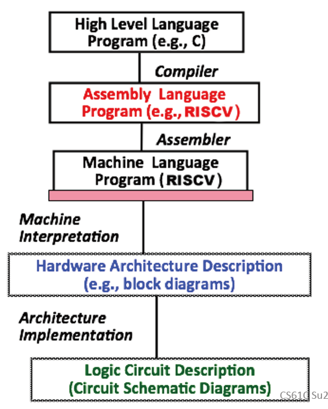

# Lec01: Intro, Number Rep

## Six Great Ideas in Computer Architecture

1. Abstraction
2. Technology Trends
3. Principle of Locality/Memory Hierarchy
4. Parallelism
5. Performance Measurement & Improvement
6. Dependability via Redundancy

## Great Idea #1: Abstraction

## Number Representation

### Number Bases

与十进制相比，二进制的误差范围更大，在电压源发生波动时仍能正确表示

### Signed Representations

**Sign and Magnitude**

最高位为符号位，剩下的表示数值

0有两种表示方式，正数和负数的个数相等

加法操作比较奇怪，不是很理想

**Biased Notation**

"actual value" = "unsigned value" + bias (bias can be positive or negative)

优点：最大正数和最小负数对应无符号的最大和最小表示

缺点：0不是用全零来表示

**One's Complement**

最高位的权值为$-(2^{n-1}-1)$ 为补数，其余权值不变

缺点：零有两种表示方式（all zeroes or all ones），加法操作复杂

**Two's Complement**

最高位的权值为$-2^{n-1}$为补数，其余权值不变

优点：0用全零表示，加法和无符号相同，可以通过最高位判断正负性

**Two's Complement Summary**

- 被所有现代硬件使用
- 几乎均匀地分开了正负数表示（负数比正数多一个，因为0是正0）
- 可以用最高位作为符号位
- -x = ~x + 1

### Overflow

最高有效位：Leftmost is most significant bit(MSB)

最低有效位：Rightmost is least significant bit(LSB)

算术运算的结果无法用硬件的有限位表示时会发生溢出

Two's complement:

- 正数 + 正数 -> 可能溢出为负数
- 负数 + 负数 -> 可能溢出为正数
- 正数 + 负数 -> 不会溢出

### Sign Extension

用更多的位来表示相同的数值

- 正数只需要加0即可，负数取决于表达形式
- Sign and magnitude: 在符号位后面加0
- One's complement: copy MSB
- Two's complement: copy MSB

