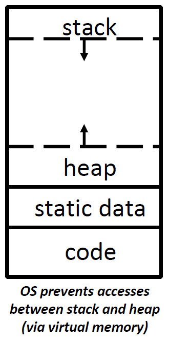
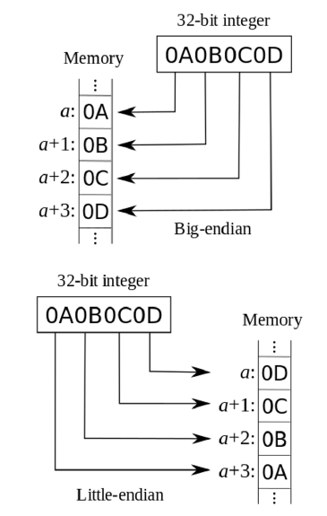

# Lec04: C Memory Management and Usage

## C Memory Layout

- **Stack**: local variables, grows downwards
- **Heap**: resizes dynamically, grows upwards
- **Static Data**: global and static variables, does not grow or shrink
- **Code**: loaded when program starts, does not change **typically**

### Stack

栈由栈帧组成，栈帧通常包括函数的返回地址、参数、局部变量

Warning: 函数调用不能返回局部变量的地址。编译器会报warning

### Static Data

- Place for variables that persist
  - Examples: String literals, global variables
  - String literal examples: char *str = "hi";（区别于char str[] = "hi";）
- Static data段的大小不变，但部分数据的值可以改变，string literal不能改变
- Static data段分为read-only和read-write两部分

### Code

代码段一般不变，但自修改代码可以改变代码段

## Endianness

- 大端法：高位字节放在低地址
- 小端法：低位字节放在低地址

### Common Mistakes

- 字节顺序只针对占用多个字节的数据类型
- 字节顺序指的是在内存中的字节存储顺序，而不是数的表示形式

## Dynamic Memory Allocation

- Want persisting memory (like static) even when we don't know size at compile time.
  - e.g. input files, user interaction

### sizeof()

`sizeof()`返回的大小**以char大小为单位**，`sizeof(char) == 1`是永真的

但是char的大小可能是多个字节，一般都是1个字节

只有当数组定义在相同函数内的栈上时，才能用`sizeof()`确定数组的大小，如int a[61];

### malloc(n)

分配含有连续n个字节的**未初始化的**内存空间

`malloc()`通常用于结构体和数组的分配，用`sizeof()`和类型转换是好文明:)

e.g. `int *p = (int *) malloc(n*sizeof(int));`

### free(p)

释放指针p指向位置处的分配块，p必须是m/c/realloc()返回的指针

要确保程序中不会丢失分配块初始地址，如`p++`是坏文明:(

### Calloc

`void *calloc(size_t nmemb, size_t size)`

与`malloc()`类似，但会**初始化为0**

`nmemb`为元素个数，`size`为单个元素的大小

e.g. `int *p = (int *) calloc(5, sizeof(int));`

### Realloc

- Useful when I need more or less memory in an array

`void *realloc(void* ptr, size_t size)`

`ptr`为之前分配块得到的指针

`size`为新的块大小

返回新的大小为`size`的分配块的指针，并将原来块中的内容复制到新块中

`realloc()`返回的指针可能是新的地址，也可能与`ptr`相同（如果无法分配）

**这些函数在stdlib.h库中**

## Memory Errors

- Segmentation Fault
  - "An error in which a running Unix program attempts to access memory not allocated to it and terminates with a segmentation violation error and usually a core dump."
  - 访问未分配的内存地址
- Bus Error
  - "A fatal failure in the execution of a machine language instruction resulting from the processor detecting an anomalous condition on its bus. Such conditions include invalid address alignment(accessing a multibyte number at an odd address), accessing a physical address that does not correspond to any device, or some other device-specific hardware error."
  - 错误的对齐、访问不存在的物理地址、随机性的特定于设备的错误

## Common Memory Problems

1. Using uninitialized values
2. Using memory that you don't own
   - Using NULL or garbage data as a pointer
   - De-allocated stack or heap variable
   - Out of bounds reference to stack or heap array
3. Freeing invalid memory
4. Memory leaks

### C String Standard Functions Revised

- Accessible with *#include <string.h>*

- `int strnlen(char *string, size_t n);`

  - Return the length of `string`(not including null term), searching up to `n` bytes

- `int strncmp(char *str1, char *str2, size_t n);`

  - Return 0 if `str1` and `str2` are identical, comparing up to `n` bytes

- `char *strncpy(char *dst, char *src, size_t n);`

  - Copy up to the first `n` bytes of string `src` to the memory at `dst`. Caller must ensure that `dst` has enough memory to hold the data to be copied.

## Memory Leaks

- Java有垃圾回收，而C没有
- Memory leak指分配内存后丢失了指向该内存区域的指针，导致无法释放内存

- Rule of Thumb: More `malloc` than `free` probably indicates a memory leak
- Memory leak可能出现在改变指针的时候

## Debugging Tools

Valgrind: 动态分析工具，运行时分析查找内存错误，收集有关内存管理的信息，但无法保证找到所有的内存错误

