# Lec05: Floating Point

Computer arithmetic that supports this called floating point due to the "floating" of the binary point.

科学计数法能使数字有良好的范围，同时保持有限位数下的良好计算精度

科学计数法下的组成部分：binary point, significand, base, exponent and the sign of the number

本课介绍的是IEEE Standard 754

## Goals for IEEE 754 Floating Point Standard

- 希望实现在所有计算机上的结果都一致的标准实数运算
  - 因为计算机对实数的表示是近似的
- 保持尽可能大的精度
- 帮助程序员解决实数运算中可能出现的错误
  - $+\infty$, $-\infty$, Not-A-Number(NaN), exponent overflow, exponent, underflow, +/- zero
- 希望编码与Two's complement有些兼容
  - e.g., 浮点的+0与Two's complement的0表达相同
  - 希望计算机能在不了解浮点的情况下对数字进行排序或比较，即编码在比较时应当很简单

## Floating Point Encoding: Single Precision

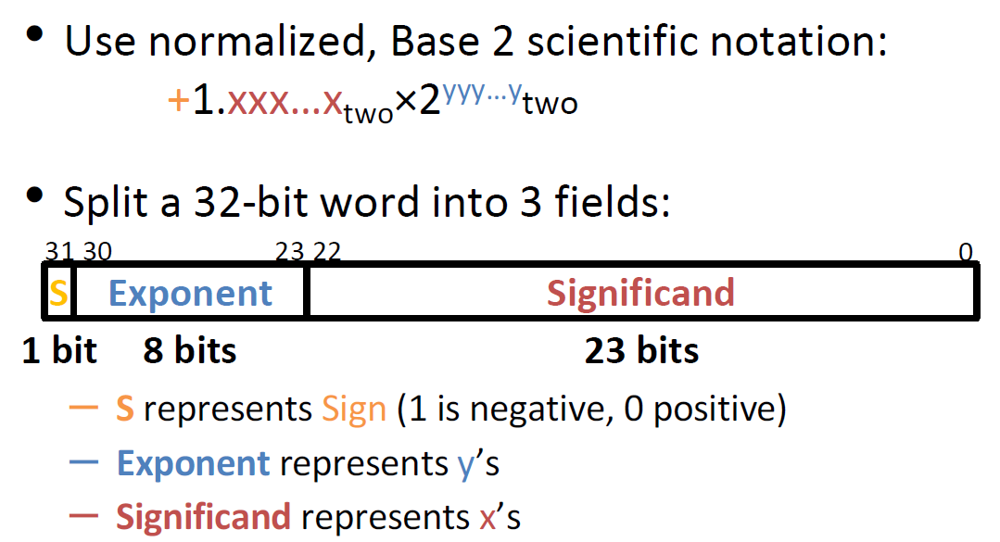

设计思想上与Sign & Magnitude相似

可以用无符号比较来比较浮点数的大小

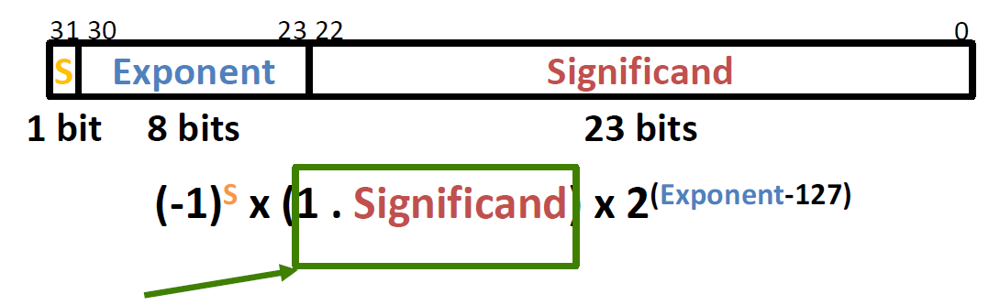

- Use **biased notation** but with bias of -127(1-2^8-1^)
  - 从Exponent域读取无符号数，加上bias(-127)得到真正的指数部分
  - Exponent field: 0 to 255
  - Actual exponent: -127 to 128

- To encode in biased notation, subtract the bias of -127 then encode in unsigned

## Exponent Field

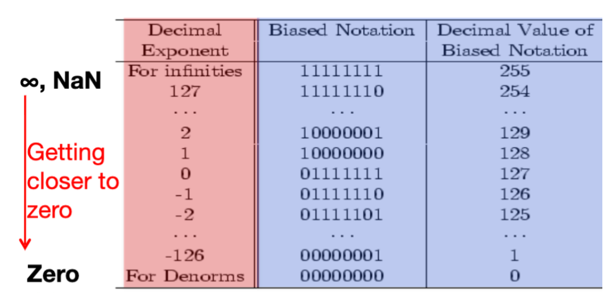

- 最大指数为全1，用来表示$\infty$和NaN
- 最小指数为全0，用来表示0和非正规化数(denormalized number)，非正规化数非常接近0
- 其余的指数(-126 to 127)为标准化的浮点数

## Double Precision FP Encoding

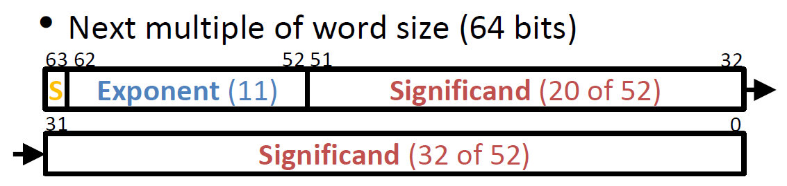

- Exponent bias is 1 - 2^10^ = -1023
- 精度更高

## Floating Point Special Cases

### Representing Zero

在含有隐式的前置1时，全0不等于0

- **Special case**: Exp and Significand all zeros = 0
  - 有+0和-0两种表达形式

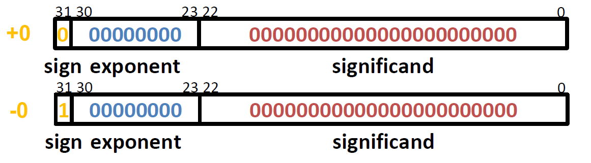

### Representing $\pm \infty$ 

- $\pm \infty$在除以0的时候出现，$\infty$是一个数，可以进行比较 e.g. x/0 > y
- **Special case**: Max exponent, all zero significand

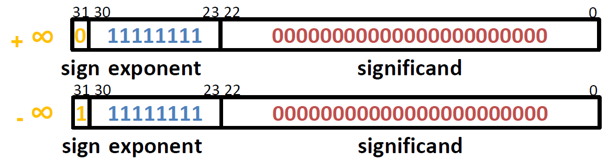

### Representing NaN

- 0/0, $\sqrt{-4}$, $\infty - \infty$时为Not-A-Number
  - 表示NaN有利于debug
  - OP(NaN, some number)  = NaN 即对NaN进行任何运算的结果都是NaN
- **Special case:** Max exponent, non-zero significand

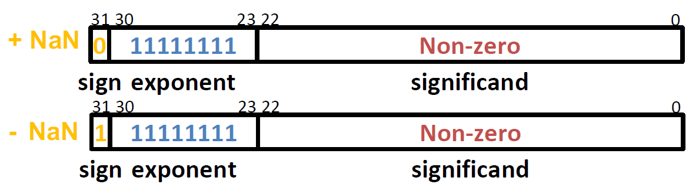

### Representing Very Small Numbers

最小的正规化数为a = 1.00...0 $\times$ 2^1-127^ = 2^-126^

为表达0 to a的数，引入非正规化数

- **Special case:** Exp = 0, Significand $\neq$ 0

- 特点：没有前置1，在Exp = 0时Actual exp = -126（实际上是将binary point左移一位到前置1的左边）

最小的非正规化数：$\pm$ 0.0...01 $\times$ 2^-126^ = $\pm$ 2^-149^

最大的非正规化数：$\pm$ 0.1...1 $\times$ 2^-126^ = $\pm$ (2^-126^ - 2^-149^)

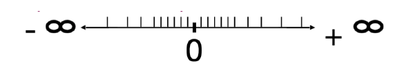

所有非正规化的数字之间也有均匀的差距

### Floating Point Number Summary

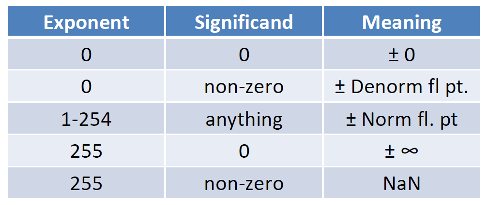

## Floating Point Limitations

- Overflow: Exponent is larger than can be represented (abs(x) > 2^128^)
- Underflow: Negative exponent is larger than can be represented (0 < abs(x) < 2^-149^)

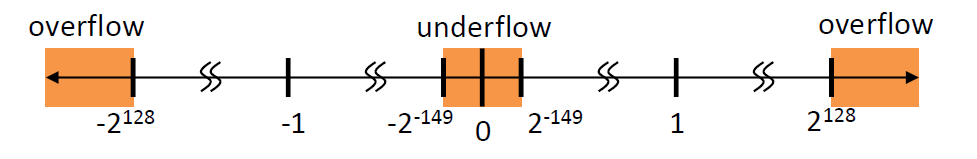

- Rounding: Occurs when the result runs off the end of the Significand
  - FP有不同的舍入方式，一般是bound to the nearest
- **浮点加法是不可结合的：**$(a+b)+c \neq a+(b+c)$
  - 这是rounding error导致的，因为significand只有23位
- 浮点数无法表示所有整数，如2^24^ + 1 = 16777216 (fp) 16777217 (actual)

### Floating Point Gaps

每次增加0x00000001并不会使浮点数增加相同的值，所增加的值取决于exponent field

因此每个可表示的浮点数之间的差距是随指数的增加而增加的

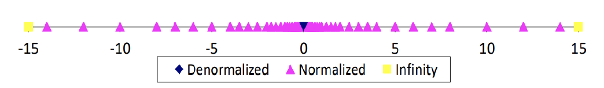

数值范围的扩大意味着精度的降低，数并没有变多

