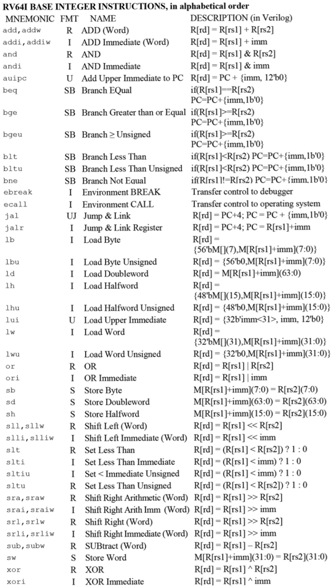

# Lec06: Introduction to Machine Language: RISC-V

每一种特定的架构都有对应的汇编语言，各不相同

汇编语言是不可移植的，特定于体系结构

## Mainstream Instruction Set Architectures


x86的指令长且复杂

ARM更先进，有更多的功能，且不是开源的

RISC-V是开源的，用于学术，适合各个层次的计算

## Complex/Reduced Instruction Set Computing

早期趋势：加入更多的指令来细化操作，使程序更小，CISC

CISC缺点在于难以学习以及硬件运行得更慢（因为硬件没那么复杂），优点在于可以减少编译器的工作

RISC指令集更简单，容易学习，硬件运行得快，复杂指令由简单指令构成

研究发现，限制x86只执行简单指令时，对复杂指令的处理速度会更快

## Registers

汇编语言用寄存器来存储变量

寄存器大小固定、数量有限、访问速度快、耗电少

如果变量比寄存器多，则放到内存中

### Memory Hierarchy

- Registers: 32 registers * 32 bits = 128Bytes
- RAM: 4-32GB
- SSD: 100-1000GB


寄存器和Cache在CPU上

### RISCV -- How Many Registers?

Tradeoff between speed and availability

更多的寄存器意味着可以容纳更多的变量，但同时所有寄存器的速度也会下降

RISCV有32个寄存器(x0-x31)，每个寄存器为32bit，容纳一个word

Word只是固定大小的数据，是指令集或硬件处理时的单位数据，一般定义为一个寄存器的大小

### RISCV Registers

每个寄存器有自己的ID(x0-x31)和名字

- Safe registers: 用于保存编程变量
  - s0 - s1 $\Leftrightarrow$ x8 - x9
  - s2 - s11 $\Leftrightarrow$ x18 - x27
- Temporary registers: 用于保存临时变量
  - t0 - t2 $\Leftrightarrow$ x5 - x7
  - t3 - t6 $\Leftrightarrow$ x28 - x31

- 其它寄存器有特殊用途

寄存器没有类型，基于对寄存器执行的操作来判断存储的内容

### Zero Register

0在代码中经常出现，因此它有自己的寄存器

寄存器x0的值永远为0，对x0的写操作都是无效的

当把一个未修改的值写回寄存器时，可以让该寄存器的值加上x0的值来加快速度

### Registers in a Computer

计算机的五个部分：

- Control
- Datapath
- Memory
- Input
- Output

连接这五个组件的最常用方法是总线

寄存器是datapath的一部分

## Assembly Code

指令的一般格式为：op dst, src1, src2

这样能确保硬件更为简单

RISC-V汇编代码中的注释以#开头



## Immediate Instructions

常数被称为立即数(immediate)

含有立即数的指令格式为：opi dst, src, imm

含有'i'的指令将src2替换为立即数

立即数最多为**12bit**，解释为**符号扩展的二进制补码值**

RISC-V中不存在*subi*指令，因为可以用*addi*代替，减少指令数量

## Data Transfer

RISCV指令只对寄存器进行操作，而汇编语言要访问内存

数据传输指令用于在寄存器和内存之间传输数据

- Store: register TO memory
- Load: register FROM memory

指令格式为：memop reg, off(bAddr)

bAddr = base address

reg和bAddr均为寄存器，off为立即数

- Reminder: 由于寄存器存的字是无类型的，bAddr必须确保是有效的内存地址，否则会segmentation fault

### Data Transfer Instructions

- Load Word(lw)
  - 把bAddr + off处的数据从内存加载到reg上
- Store Word(sw)
  - 把reg里的数据存放到bAddr + off处

### Values in Memory

Assembler directives

- .data表示存储在内存中的数据
  - .word, .byte, etc
  - labels用于指向内存中的数据
- .text表示存储在内存中的代码

```assembly
.data
source:
		.word	3
		.word	1
		.word	4
.text
main:
		la t1, source
		lw t2, 0(t1)
		lw t3, 4(t1)
```

在以上例子中，3在内存的低位，4在内存的高位

RISC-V的字节顺序是小端法

RISC-V的所有基本指令都是符号扩展的

### Byte Instructions

- lb/sb以字节为单位进行数据传输，使用寄存器最低位的一个字节

  - 对于*sb*而言，高位的24bit被忽略，只传输一个字节

  - 对于*lb*而言，高位的24bit被符号扩展填充

### Half-Word Instructions

- lh/sh以两个字节为单位进行传输，使用寄存器最低位的两个字节
  - 对于*sh*而言，高位的16bit被忽略，只传输两个字节
  - 对于*lh*而言，高位的16bit被符号扩展填充

### Unsigned Instructions

- lhu和lbu采用无符号扩展

不存在*s(h/b)u*和*lwu*

### Data Transfer Greencard Explanation


## Control Flow Instructions

RISCV通过在label之间跳跃来实现控制流

- Branch If Equal(beq)
  - beq reg1, reg2, label
  - 如果value in reg1 = value in reg2，则跳转到label处
  - 否则继续执行接下来的指令
- Branch If Not Equal(bne)
  - bne reg1, reg2, label
  - 如果value in reg1 $\neq$ value in reg2，则跳转到label处
- Jump(j)
  - j label
  - 无条件跳转到label处
- Branch Less Than(blt)
  - blt reg1, reg2, label
  - 如果value in reg1 < value in reg2，则跳转到label处
- Branch Greater Than or Equal(bge)
  - bge reg1, reg2, label
  - 如果value in reg1 >= value in reg2，则跳转到label处

### Break down the If Else

- C code:

```C
if(i==j){
	a = b;
} else{
	a = -b;
}
```

- RISCV:

```assembly
# i -> s0, j -> s1
# a -> s2, b -> s3
bne s0, s1, else
then:
add s2, s3, x0
j end
else:
sub s2, x0, s3
end:
```

- C code:

```C
if(i<j){
	a = b;
} else{
	a = -b;
}
```

- RISCV:

```assembly
# i -> s0, j -> s1
# a -> s2, b -> s3
bge s0, s1, else
then:
add s2, s3, x0
j end
else:
sub s2, x0, s3
end:
```

### Loops in RISCV

实现的关键在于条件分支

### Program Counter

分支和跳转指令通过改变PC来改变逻辑流

PC是一个特殊的寄存器，存放着当前正在执行的代码的地址，不能像普通寄存器一样被访问

### Control Flow Greencard Explanation


**保证PC永远是偶数**，因为存在2字节长的指令

### Shifting Instructions

- Logical shift: Add zeros as you shift
- Arithmetic shift: Sign-extend as you shift
  - 只在右移的时候有意义

- 位移值为立即数或寄存器的值


使用立即数时，只有0-31的数有意义

使用寄存器的值时，只有低位的5bit被使用，视为无符号数

### Other useful Instructions

### RISCV Arithmetic Instructions Multiply Extension

以下指令属于扩展，不是所有的RISCV都支持

- Multiplication(mul and mulh)
  - mul dst, src1, src2
  - mulh dst, src1, src2
  - src1 \* src2: mul获取低32位，mulh获取高32位
- Division(div and rem)
  - div dst, src1, src2
  - rem dst, src1, src2
  - src1/src2: div获取商，rem获取余数

### RISCV Bitwise Instructions


### Compare Instructions

- Set Less Than(slt)
  - slt dst, reg1, reg2
  - 如果value in reg1 < value in reg2，则dst = 1，否则dst = 0

- Set Less Than Immediate(slti)
  - slti dst, reg1, imm
  - 如果value in reg1 < imm，则dst = 1，否则dst = 0

### If Else Design

C code:

```c
if(i<j){
	a = b;
} else{
	a = -b;
}
```

RISCV:

```assembly
# i -> s0, j -> s1
# a -> s2, b -> s3
slt t0, s0, s1
beq t0, x0, else
then:
add s2, s3, x0
j end
else:
sub s2, x0, s3
end:
```

### Environment Call

*ecall*是应用与操作系统交互的方法，不接受任何参数，利用寄存器a0的值

a0中的值会传递给OS来确定要执行什么操作，例如：

- 打印值
- 退出程序
- 为程序分配内存

A list of the ecall values supported by venus:
https://github.com/ThaumicMekanism/venus/wiki/Environmental-Calls

Linux实际上使用寄存器87来选择调用的函数

## Summary

- RISC-V Instructions
  - Arithmetic: add, sub, addi, mult, div, rem
  - Data Transfer: lw, sw, lb, sb, lbu
  - Branching: beq, bne, bge, blt, jal, j, jalr, jr
  - Bitwise: and, or, xor, andi, ori, xori
  - Shifting: sll, srl, sra, slli, srli, srai

