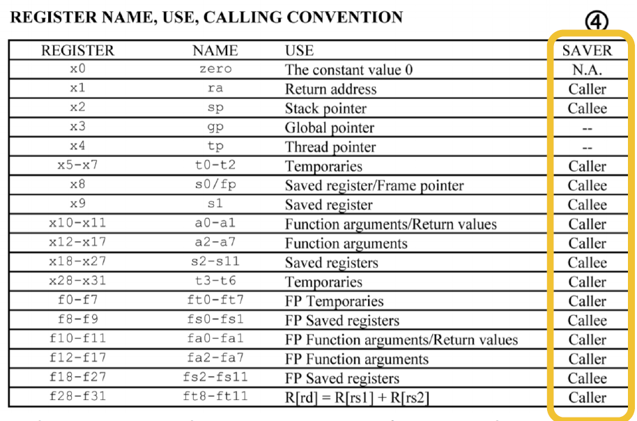
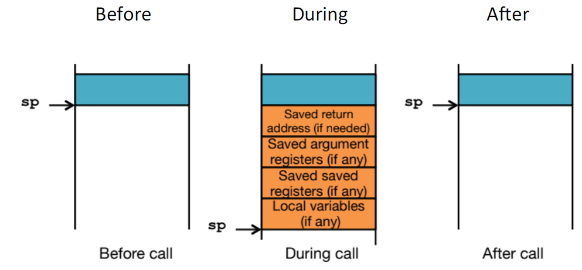

# Lec07: More RISC-V, RISC-V Functions

C代码可以被编译成不同的汇编语言，但一种汇编语言只能在支持它的硬件上运行

x86只能在Intel芯片上运行

## Pseudo-Instructions

伪指令是更易读的指令名称，本质上由其它基础指令组成，并没有在硬件上实现

### More Pseudo-Instructions

- Load Immediate(li)
  - li dst, imm
  - 将32位的立即数加载到dst处
  - addi不能放入整个32位的数，li指令由addi和lui组成
- Load Address(la)
  - la dst, label
  - 将label处的地址加载到dst处
  - la指令可翻译为auipc dst, \<offset to label\>
  - auipc是将一个立即数加上pc后加载到dst处
- No Operation(nop)
  - nop
  - 什么都不做
  - nop指令可翻译为addi x0, x0, 0

事实上，j指令也是一个伪指令，伪指令对于写汇编代码来说很重要

## Functions in Assembly

### Six Steps of Calling a Function

1. 将参数放到函数可以访问的地方
2. 将控制转移到函数入口
3. 函数获取所需要的本地存储资源
4. 执行函数
5. 将返回值放到可以访问的地方，清理局部资源
6. 转移控制

### Arguments and Return Values

- a0 - a7用来放函数的参数，共8个寄存器
- a0 - a1用来放函数的返回值，共2个寄存器

如果有更多的参数，则会把剩下的参数放到栈上

### Transfer Control

- Jump(j)
  - j label
  - j label是伪指令，可翻译为jal x0 label
- Jump and Link(jal)
  - jal dst, label
  - dst用于link，在调用函数时dst = ra，会将下一条指令的地址放在dst中
  - RISCV的每条指令是4字节长
  - jal x0 label相当于无链接的跳转
- Jump and Link Register(jalr)
  - jalr dst, src, imm
  - 跳转到src + imm处，并将下一条指令的地址放在dst中
- "and Link": 在跳转之前把指令的地址存储在寄存器中
- Jump Register(jr)
  - jr src
  - jr src是伪指令，由jalr实现
- ra = retrurn address register，用于存储返回地址

jal和jalr通常用于调用函数，jr通常用于从函数调用返回

### Local Storage for Variables

栈指针sp存储栈底的地址

- 减小sp，让栈向下增长
- 将变量存储在栈上
- 清理栈只需要增加sp

## Function Calling Conventions

- Caller: the calling function
- Callee: the function being called

### Saved Registers(Callee Saved)

这些寄存器在函数调用前后不变

- 当callee使用这些寄存器时，要在返回前恢复这些寄存器原来的值

- 保存旧值 -> 使用寄存器 -> 恢复旧值 -> 返回

- s0 - s11(saved registers)
- sp(stack pointer)

### Volatile Registers(Caller Saved)

这些寄存器可以被callee随意改变

- 如果caller后续还要用这些寄存器，则在调用函数前将这些寄存器的值存储在其它地方
- t0 - t6(temporary registers)
- a0 - a7(return value and arguments)
- ra(return address)

### Register Conventions

寄存器可分为两类：

- Caller saved
  - Callee可以随意使用和改变，由caller进行保存和恢复操作
- Callee saved
  - Callee在修改前必须保存旧值，用完后恢复旧值

Caller和Callee分别保存volatile register和saved register



通常会将需要保存的寄存器值压入栈中



### Basic Structure of a Function

```assembly
Prologue
	func_label:
	addi sp, sp, -framesize
	sw ra, <framesize-4>(sp)
	#store other callee saved registers
	#save other regs if need be
Body (call other functions...)
	...
Epilogue
	#restore other regs if need be
	#restore other callee saved registers
	lw ra, <framesize-4>(sp)
	addi sp, sp, framesize
	jr ra
```

## Summary

- Minimize register footprint
  - 适当选择寄存器，以减少保存到栈的次数，加快运行速度
  - 只在必须保存的时候保存
- Function does NOT call another function
  - 不调用其它函数时，使用t0 - t6寄存器，就不需要保存到栈了

