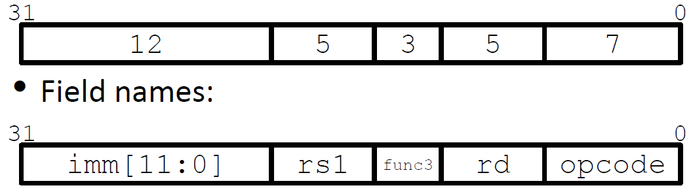

# Lec08: RISC-V Instruction Formats

## Stored-Program Concept

最早的计算机的程序很难重编

- ENIAC(University of Pennsylvania - 1946)
  - 运行速度快，能在2.8ms内计算10位乘法
- 用电线和开关编程
  - 一般要2-3天才能写一个新程序

若将指令表示为位模式，则可以把程序存储在内存中，重新编程只需要对内存重写即可，而不是对电脑进行重新连线。这类计算机被称为von Neumann计算机，使现代计算成为可能

### Binary Compatibility

指令集要向后兼容，保证新的机器可以运行旧程序，会导致指令数量太多，可能会随时间推移而降低速度，例如x86

### Translation by Assembler

汇编器将汇编代码翻译为机器代码（目标文件），目标文件通过链接形成可执行文件


### Instructions as Numbers

RISCV的指令大小通常为1个字（4字节）

将4字节的指令划分为多个域，用于硬件处理的不同阶段

要让不同域所处的位置固定，确保硬件处理更为简单，能以相同的方式解释不同的指令

六种指令格式：

- R-Format(format for registers): 包含3个寄存器的指令
  - add, xor, mul等算术/逻辑指令
- I-Format(two registers and immediate): 含有立即数或加载的指令
  - addi, lw, jalr, slli等
- S-Format(format for store): 存储指令
  - sw, sb等
- SB-Format(branch instructions): 分支指令
  - beq, bge等
- U-Format(a big immediate/address): 含有upper immediate(20 bits)的指令
  - lui, auipc等
  - lui将20位立即数加载到32位寄存器的上半部分
- UJ-Format: 跳转指令
  - jal


## R-Format

R-format的域划分如下：


每个域的值为无符号数

- opcode(7)确定操作所属的子集
  - e.g. R类的opcode = 0b0110011, SB类的opcode = 0b1100011
- funct7 + funct3(10)与opcode结合确定操作类型，这两个域描述所做的具体操作
  - 可以编码出2^10^个R-format指令

- rs1(5)为src1寄存器
- rs2(5)为src2寄存器
- rd(5)为destination register(dst)
  - 寄存器占5个bit，因为有32个寄存器

### Read from the Greensheet


### All RV32 R-Format Instructions


## I-Format

含有立即数的指令至多用两个寄存器(1 src, 1 dst)



与R-format的区别在于把funct7和rs2(5)合并成imm(12)，其中imm为符号数。在计算前，12bit会符号扩展为32bit

### All I-Format Arithmetic Instructions


位移指令的立即数只用到低5位的数据(0 - 31)，前7位为funct7部分，用于区分逻辑位移和算术位移

### I-Format Load Instructions


offset为12bit的有符号数，加到base上得到内存地址，将该内存地址处的值加载到dst上


funct3域编码了加载的字节数和是否进行符号扩展

## S-Format

存储指令需要两个寄存器，rs1存储基地址，rs2存储数据，不存在rd

在设计上将rd的5bit替换为立即数imm

最终立即数由imm[11:5]和imm[4:0]两部分拼接而成


### All RV32 Store Insturctions


## SB-Format

分支指令需要两个寄存器用于比较，一个跳转的地址(label)，且不对寄存器进行写操作

由于分支指令通常用于循环，循环的指令数通常不多(<50)，指令存储在内存的局部，故label可用PC到目标地址的offset来表示，即相对寻址(PC-Relative Addressing)

32bit的指令都是“字对齐”的，即每个指令的地址都是4的倍数，因此可让imm以字为单位而非字节

**Note**: 如果系统支持RISCV压缩指令（16bit的指令），则所有指令的地址都是2的倍数

### Branch Calculation

- 如果不走分支：PC = PC + 4 = next instruction
- 如果走分支：PC = PC + (imm \* 4) （对于只支持32-bit指令而言）

### RISCV Feature: 16-bit Instructions

RISCV的扩展指令集支持16-bit指令，为了支持该扩展，即使没有16-bit的指令，RISCV也让branch offset以半字为单位

缺点：branch offset的范围减半，在只支持32-bit指令的RISCV处理器上可能出错


### Branch Example


### RISC-V Immediate Encoding


### All RISC-V Branch Instructions


如果offset超出范围，则可用j指令代替，绝对寻址


## U-Format

U-format用于处理32bit的立即数，主要处理高位的20bit

需要一个dst寄存器来存放高位的20bit


- lui: load upper immediate
  - lui dst, imm
  - 将imm写到dst的高20位处，并将低12位清零
  - 用addi来设置低12位，从而将32位的数放入寄存器中
  - Corner case: 如果低12位的最高位为1，则在addi中会符号扩展为32位，导致高20位的立即数-1
  - Solution: 如果低12位的最高位为1，则预先将高20位的值+1
  - lui与addi结合得到伪指令li dst, imm加载32位数
- auipc: add upper immediate to PC
  - 用于PC-Relative addressing
  - 将高位立即数加到PC并把值放到dst
  - e.g. Label: auipc x10, 0将Label的地址放入x10

## UJ-Format

跳转指令可能跳转到代码的任何地方


- jal指令会把PC + 4存在rd中，设置PC = PC + offset
- j指令是伪指令，通过jal实现
- 对imm的字节顺序进行调整，减少硬件开销

### jalr Instruction(I-Format)


- jalr rd, rs1, offset
- 将PC + 4存到rd中，令PC = rs1 + offset
- offset为12bit，符号扩展，**以字节为单位**

```assembly
# ret and jr psuedo-instructions
ret = jr ra = jalr x0, ra, 0
jalr x1 = jalr ra, x1, 0
# Call function at any 32-bit absolute address
lui x1, <upper 20 bits>
jalr ra, x1, <lower 12 bits>
# Jump PC-relative with 32-bit offset
auipc x1, <upper 20 bits>
jalr x0, x1, <lower 12 bits>
```

## Summary


