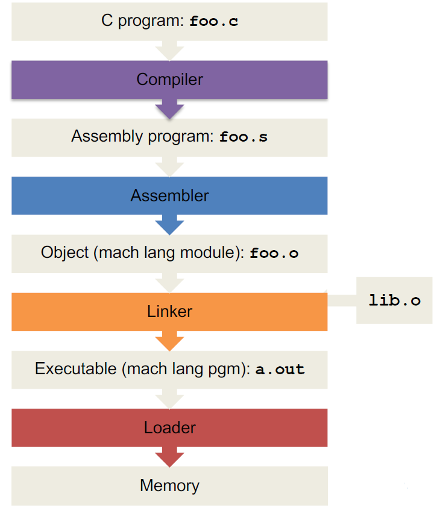
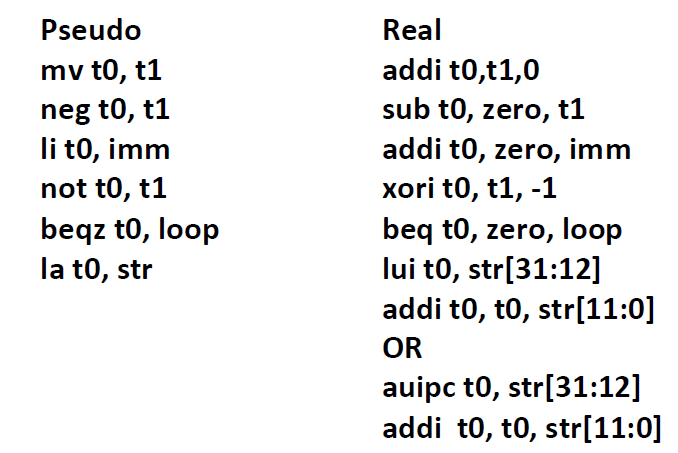
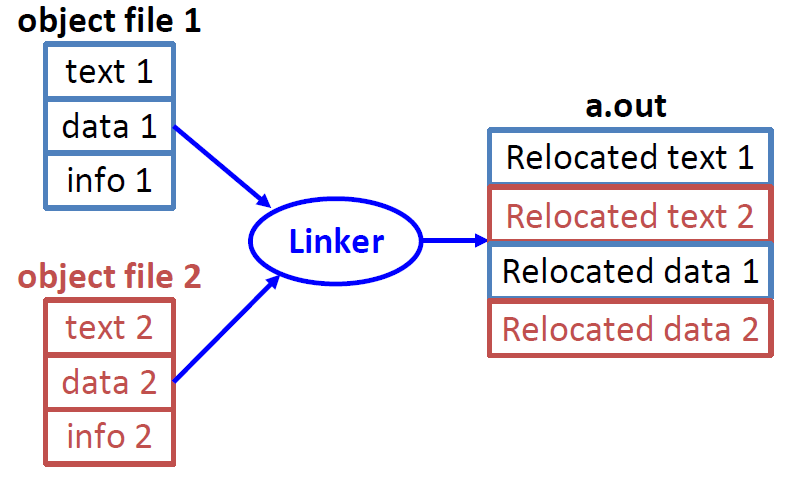
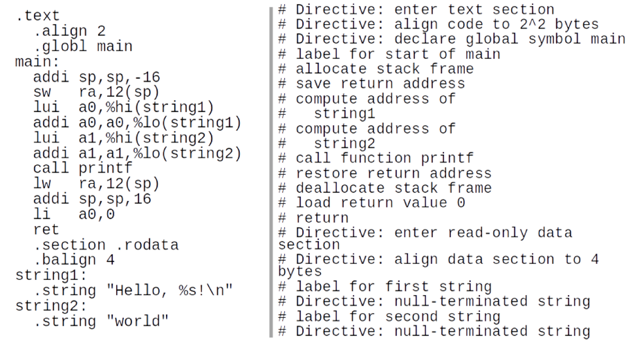
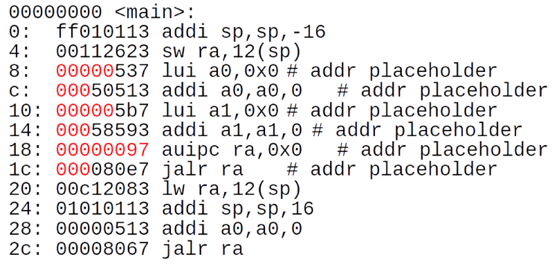
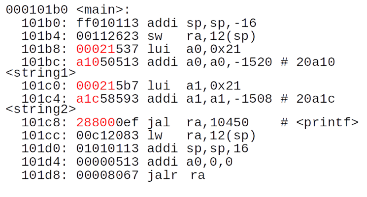

# Lec09: Running a Program - CALL

CALL = Compiler + Assembler + Linker + Loader



## Translation vs. Interpretation

- Interpreter: 从源代码直接执行程序
  - 效率不高(~10x)，但容易编写，代码更小(~2x)，可以在任何机器上运行，给出的错误信息更好更具体(e.g. Python, Venus)
- Translator: 将源代码转化为另一个语言的等价程序
  - 从高级语言翻译成低级语言，性能得到提升，并且能够对用户隐藏源代码

C语言的一大特征是允许单独编译各个文件，之后再合并成一个可执行文件，**跨文件可访问的有函数和全局变量**

## Compiler

- 输入：高级语言代码
- 输出：汇编语言代码
  - 输出中可能包含伪指令
  - 实际情况中会先由预处理器处理宏指令(#)

## Assembler

- 输入：汇编语言代码
- 输出：真正的汇编代码（替换伪指令）和信息表，得到目标文件

汇编器会读取并使用指令，替换伪指令，并最终产生机器代码

### Assembler Directives

汇编程序指令为汇编程序提供指导，但实际上并不会产生机器代码

- .text: 接下来的部分的机器代码会被放入代码段
- .data: 接下来的部分会被放入数据段

汇编代码中.data和.text部分可以相互交织

- .globl sym: 声明*sym*标签是全局的，从而能被其它文件引用
- .asciiz str: 将字符串*str*存储在内存中，并以NULL结尾
- .word w~1~...w~n~:  字之间用空格分隔，将n个32-bit的量存在内存的连续部分

### Pseudo-Instruction Replacement



## Two Passes

算术、逻辑运算指令的相关信息都在指令内

branch和jump需要相对地址，在替换伪指令后可以知道branch的数量，可以用two passes方法来确定相对地址

- Pass 1:
  - 将伪指令替换为真正的指令
  - 记住label的位置，并去掉label
  - 去除注释、空行等
  - 检查错误
- Pass 2:
  - 用label的位置来生成相对地址，用于branch和jump
  - 生成目标文件

但是这样仍然无法解决跳转到外部文件label的情况，需要知道最终外部文件在内存的哪个位置

对数据的引用可以把la分解成lui和addi，但需要知道数据的地址

这些都无法在汇编单个文件时确定，需要创建两个表来为其它文件存储这些信息，在链接时使用

### Symbol Table

符号表包含着其它文件可能用到的信息，每个文件有自己的符号表，其它文件可以借助符号表来知道可以访问的条目和对应的位置

- Labels: function calling
- Data: anything in the *.data* section; variables may be accessed across files

通过记录label可以解决引用的问题，这在Pass 1中完成

### Relocation Table

重定位表包含了该文件之后需要的条目，即当前尚未确定的条目

- Any external label jumped to: *jal* or *jalr*
  - internal
  - external (including library files)
- Any piece of data
  - such as anything referenced in the *data* section

### Object File Format

1. object file header: 目标文件其它部分的大小和位置（索引部分）
2. text segment: 机器代码
3. data segment: 源文件的数据（二进制格式）
4. relocation table: 标识需要由链接器处理的代码行
5. symbol table: 文件的label和可以被其他文件引用的数据
6. debugging information: 使用GCC并添加-g标志，就可以从程序中获取调试信息

ELF是目标文件的一种标准格式

## Linker

- 输入：目标文件和信息表
- 输出：可执行文件

将若干个目标文件链接成一个可执行文件

链接器允许对各个文件单独编译，使得在修改某个文件时不需要对整个程序重新编译

以前被称为"Link Editor"，因为它修改了jump和link指令的链接部分



1. 将每个目标文件的代码段合并
2. 将每个目标文件的数据段合并，并把它连接到代码段后面
3. 扫描重定位表，解决引用问题，**即填充所有的绝对地址**

### Three Types of Addresses

- PC-Relative Addressing (*beq*, *bne*, *jal*)
  - **never relocate**
- External Function Reference (usually *jal*)
  - **always relocate**
- Static Data Reference (often *auipc* and *addi*)
  - **always relocate**
  - RISC-V often uses auipc rather than lui so that a big block of stuff can be further relocated as long as it is fixed relative to the pc

### Absolute Addresses in RISC-V

- 与外部文件相关的J-format指令需要知道offset的值，要重定位进行修改

- 与静态区域的数据相关的加载和存储指令需要知道相对于全局指针的位置，需要重定位进行修改
- 条件分支利用PC-Relative，指令之间的距离不会修改，不需要重定位修改

### Resolving References

对于RISC-V 32，链接器假设代码段的第一个字位于0x10000，与虚拟内存相关

链接器知道每个代码段和数据段的长度，以及代码段和数据段的顺序

因此，链接器可以计算每个label和被引用数据的绝对地址

1. 在所有符号表中查找引用的数据或label
2. 如果找不到，则在库文件中找（如*printf*）
3. 一旦确定了绝对地址，就在机器代码中恰当的地方填充绝对地址

## Loader

- 输入：可执行文件
- 输出：<运行程序>

可执行文件存储在磁盘中，加载器将文件加载到内存中并运行

在实际情况中，加载是操作系统的工作

1. 读取可执行文件的文件头来确定代码段和数据段的大小
2. 为程序创建地址空间，以容纳代码段和数据段，并创建一个新的栈
3. 将指令和数据加载到新的地址空间上
4. 将程序的参数复制到栈上
5. 初始化机器的寄存器
   - 大多数寄存器被清空，栈指针赋值为栈底的地址
6. 跳转到启动程序，将程序的参数从栈复制到寄存器上，设置PC
   - 如果程序结束，启动程序会调用exit()来终止进程

## Example

- C code

```C
#include <stdio.h>
int main()
{
printf("Hello, %s\n", "world");
return 0;
}
```

- Compile Hello.c into Hello.s



- Assemble Hello.s into linkable Hello.o



- Link Hello.o into a.out



## Summary

- **Compiler** converts a single HLL file into a single assembly file *.c → .s*
- **Assembler** removes pseudo-instructions, converts what it can to machine language, and creates a checklist for linker (relocation table) .s → .o
  - Resolves addresses by making 2 passes (for internal forward references)
- **Linker** combines several object files and resolves absolute addresses .o → .out
  - Enable separate compilation and use of libraries
- **Loader** loads executable into memory and begins execution