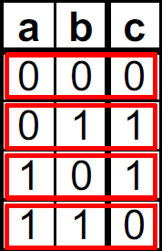

# Lec10: Combinational Logic

## Synchronous Digital Systems(SDS)

RISC-V处理器是同步数字系统

- Synchronous: 所有操作由中央时钟协调
- Digital: 用一个只有两个离散值的晶体管来表示0和1，所有数值由0和1表示，高电压为1，低电压为0

## Switches and Transistors

用电控制开关 -> 电动计算机

晶体管就是硬件的开关

现代数字系统用CMOS晶体管设计

- MOS: Metal-Oxide on Semiconductor
  - MOS晶体管受电压控制，通过流经电流的多少来判断开关状态
- C for complementary: normally-open and normally-closed switches

## CMOS Networks

晶体管有N-channel和P-channel两种

如果gate端的电压高于/低于source端的电压，则drain和source端之间建立传导路径，开关打开

V~GS~ = V~Gate~ - V~Source~; V~SG~ = V~Source~ - V~Gate~; V~TH~ = V~Threshold~

- N-channel是常闭开关，Gate端为低电压时关闭，Gate端为高电压时打开

- P-channel是常开开关，Gate端为高电压时关闭，Gate端为低电压时打开

#### Not Gate

#### NAND Gate

#### NOR Gate

### Abstraction: Block Diagrams

芯片是由晶体管和电线组成的，多个晶体管组成一个块，因此可以将复杂的晶体管群抽象成具有特定功能的块

可以通过NAND来构建AND, OR, NOT

## Combinational Logic

数字系统由两种基本的电路组成：

- Combinational Logic(CL)
  - 组合逻辑
  - 输出是输入的函数，与它过去的执行无关（无记忆）
  - e.g. 加法计算单元
- Sequential Logic(SL)
  - 时序逻辑
  - 记忆或存储信息的电路，即状态元件
  - e.g. 内存和寄存器

### Logic Gates

在CMOS中相反的版本更容易实现

## Boolean Algebra

$\neg$ 为NOT，+为OR，$\cdot$为AND

### Truth Table to Boolean Expression

对真值表中的1，写下该变量，对于真值表中的0，写下变量的补

- Sum of Products(SoP)
  - 将真值表中输出为1的行取出，再将每行的变量相乘后相加
  - e.g. $c = \neg ab + a \neg b$

- Product of Sums(PoS)
  - 将真值表中输出为0的行取出，再将每行的变量取补相加后相乘
  - e.g. $c=(a+b)\cdot (\neg a+\neg b) = \neg(\neg a\neg b+ab)$

### Laws of Boolean Algebra

## Circuit Simplification

可以通过布尔代数的运算法则对由真值表转化来的布尔算式进行简化，减少逻辑门数量，从而构建更简单更快速的硬件

更简单的布尔代数$\leftrightarrow$更小的晶体管网络$\leftrightarrow$更小的电路延迟$\leftrightarrow$更快的硬件

## Summary

Transistors -> CMOS Networks -> Combinational Logic

