# Lec11: Sequential Digital Logic

## Multiplexors (Muxes)

多路复用器是选择器，从多个输入中选择一个进行输出 (N-to-1)，另一个输入S用于判断该选择哪个输入作为输出

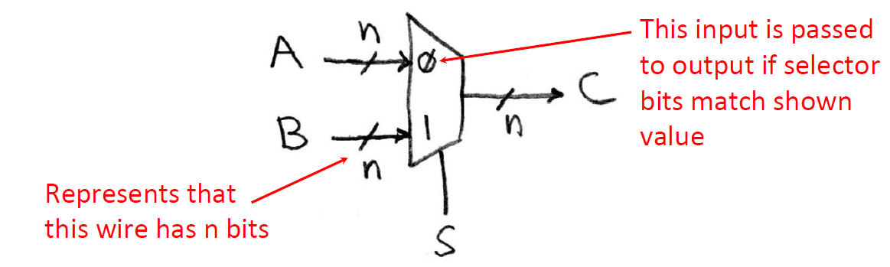

### Implement a 1-bit 2-to-1 Mux

设输入为a,b和s，输出为c

布尔表达式为$c=\overline{s}a+sb$

电路图为

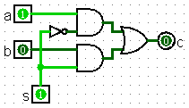

## Sequential Logic Timing

时序逻辑用于存储状态，例如寄存器、内存等，通常位于组合逻辑块之间，用于控制协调数据流

### Registers

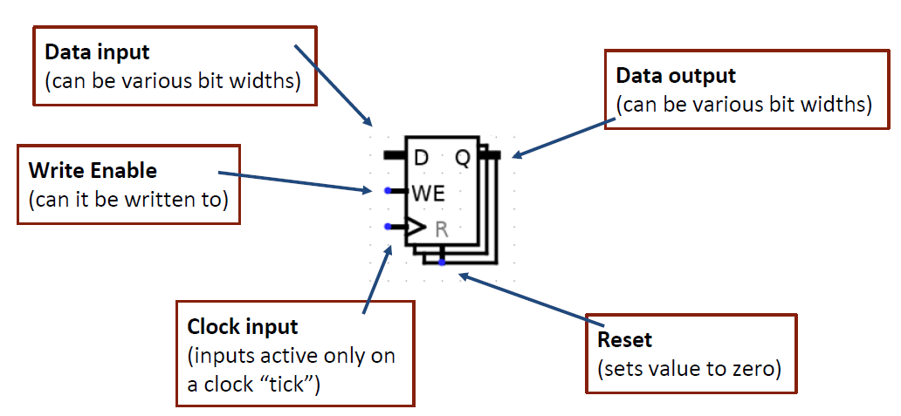

### Clocks

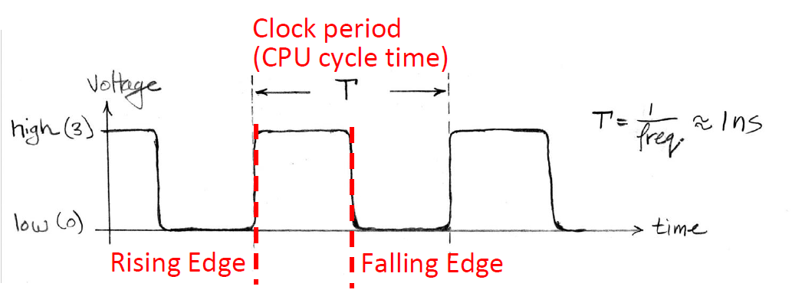

一个时钟周期包括一个上升沿和下降沿，有的时钟会把上升沿和下降沿都当作一次tick

所有信号在时钟上升沿发生改变

- 时序逻辑块(state element)只在时钟上升沿更新
- 组合逻辑块(combinational element)随时根据输入改变输出

多条输入线成群形成**总线(bus)**

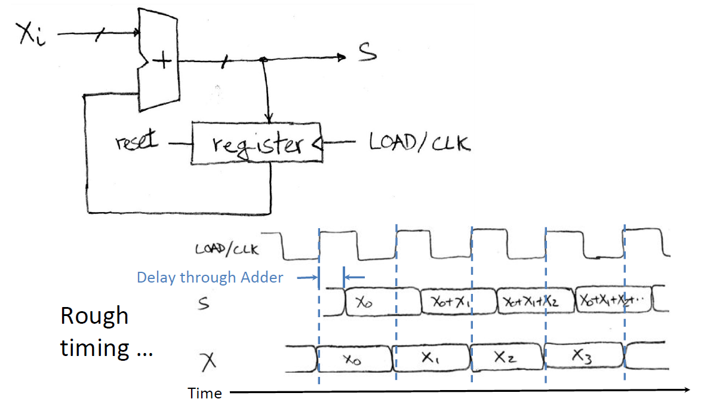

初始的s由reset设置为0

组合逻辑块的输入和输出之间存在延迟

### Register Internals

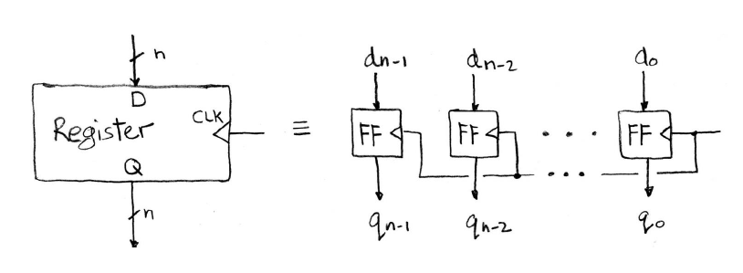

一个n-bit的寄存器对应n个"Flip-Flop"，每个的输出在0和1之间变化

也称为"D-type Flip-Flop"，D为数据输入，Q为数据输出（实际上有两个输出Q）

Flip-Flop在时钟上升沿发生，使输出等于当前的输入，输出的变化有延迟

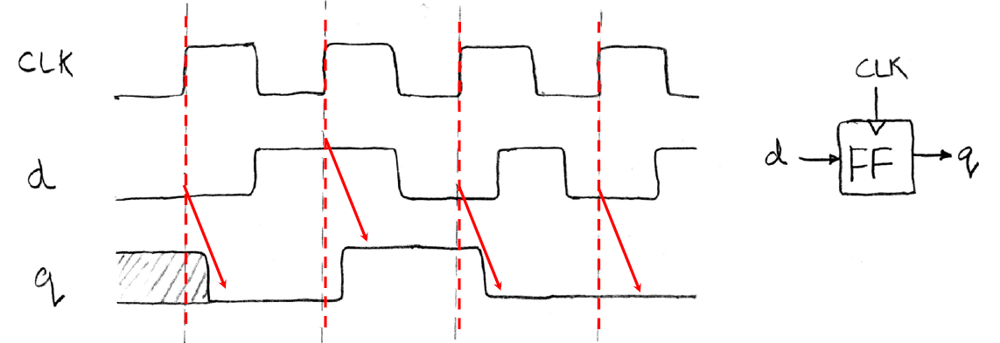

### Flip-Flop Timing Terminology

- Setup Time: 在时钟上升沿之前输入必须保持稳定的时间
- Hold Time: 在时钟上升沿之后输入必须保持稳定的时间
- "Clock-to-Q" Delay: 从时间上升沿开始，到输出发生改变的时间

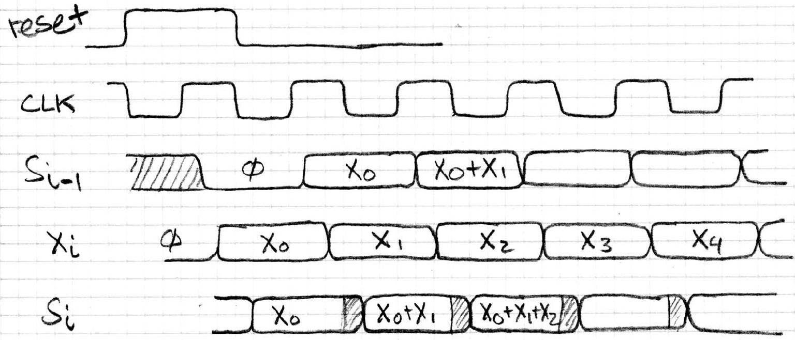

## Maximum Clock Frequency

在同步系统中，组合逻辑被寄存器分隔，时钟信号只传递到时序逻辑块上，寄存器的输出可以反馈到前面的组合逻辑上

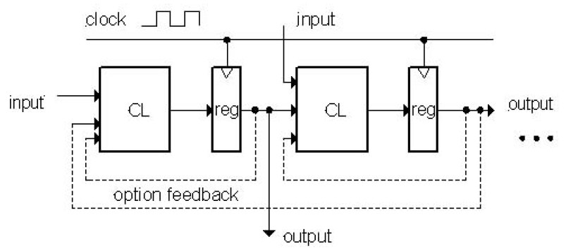

对寄存器的输入必须保持稳定时长至少setup time + hold time

### Critical Path

关键路径指的是任意两个寄存器之间的最大延迟

时钟周期必须比关键路径长，否则信号无法正常传递到下一个寄存器

Critical Path = CLK-to-Q Delay + CL Delay 1 + CL Delay 2 + CL Delay 3 + Adder Delay + Setup Time

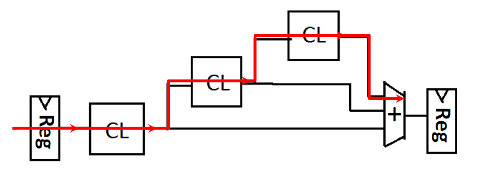

### Maximum Frequency

假定Max Delay > Hold Time

Min Period = Max Delay = CLK-to-Q Delay + CL Delay + Setup Time

Max Frequency = 1/Min Period

### Pipelining

- Pipelining: Split operation into smaller parts and add a register between each one
  - 在组合逻辑之间插入寄存器，划分阶段，缩短关键路径
  - 但插入寄存器也会增加相应的延迟

- Faster clock rate -> higher throughput (outputs)
- More stages -> higher startup latency

流水线能够提升整体性能

## Finite State Machines

时序逻辑块可以用有限状态机（确定性有限自动机）来表示

状态因输入的不同而发生改变

借助组合逻辑和寄存器，任何有限状态机都能在硬件中实现

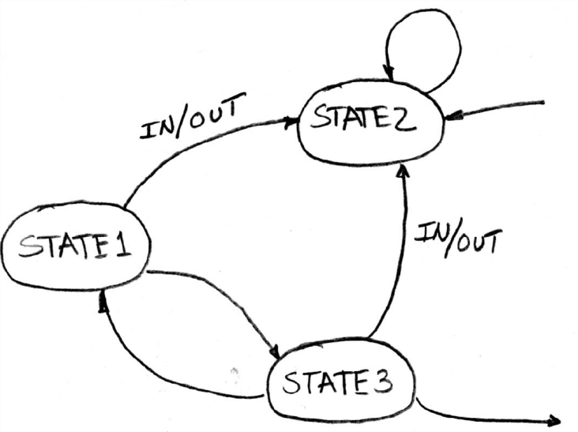

一个有限状态机的组成为：

- 状态集S
- 初始状态S~0~
- 状态转移函数，由当前状态和输入映射到下一状态和输出

时序逻辑块的状态转移由时钟控制

### Hardware Implementation of FSM

- 寄存器存储FSM的状态，输入是下一状态(next state, NS)，输出是当前状态(present/current state, PS/CS)

- 组合逻辑实现状态转移函数

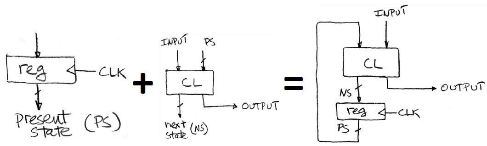

## Functional Units

- 功能单元（也称执行单元）是处理器的一部分，用于执行程序的各种基本操作
  - Arithmetic Logic Unit(ALU)
  - Floating Point Unit
  - Load/Store Unit
  - ...

### ALU

在ALU中，加、减、AND、OR是同时计算的，由控制输入s~0~和s~1~选择一个作为结果

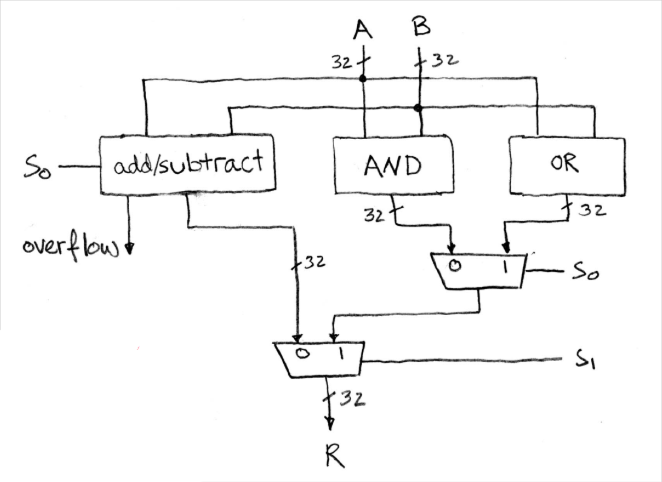

### Adder/Subtractor Design

将问题分解为多个可以串联的小部分

最低位的1-bit的加减法可以得到本位和进位

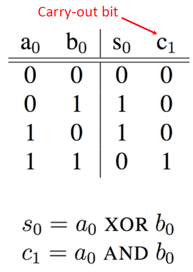

高位的1-bit加减法要用到三个输入

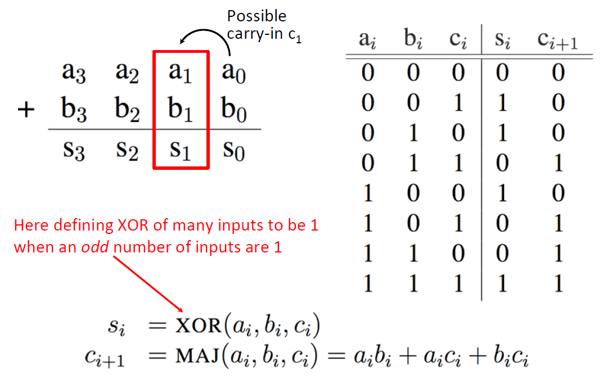

N个1-bit的加法器就可以得到N-bit的加法器：

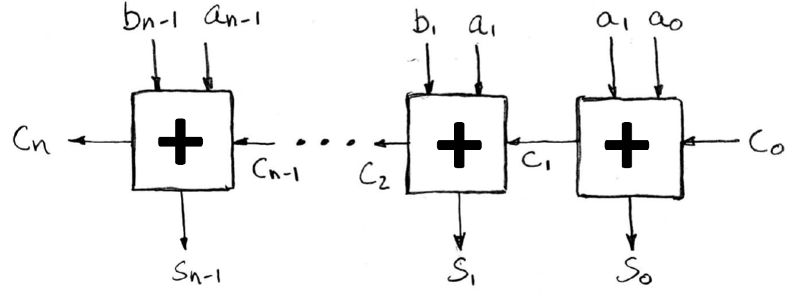

减法器可以用加上相反数（-x = ~x + 1）来实现：

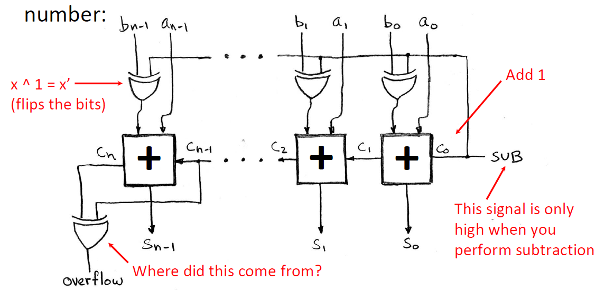

### Detecting Overflow

- Unsigned overflow
  - 加法：如果MSB的进位为1
  - 减法：如果MSB的进位为0
- Signed overflow
  - 正数相加：如果2^nd^ MSB的进位为1（正 + 正 = 负）
  - 负数相加：如果MSB的进位为1（负 + 负 = 正）
  - 判断溢出的表达式：c~n~ XOR c~n-1~