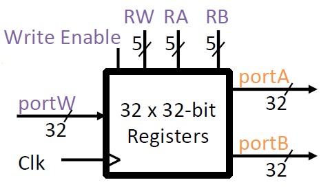

# Lec12: RISC-V CPU Datapath, Control Intro

## CPU

- Datapath: 执行操作所需要的硬件部分
  - 响应controller的要求

- Control: 决定datapath要做的事情
  - 基于输入的指令做决策

RISC-V指令集根据指令行为分为R, I, S, SB, U, UJ六种，代表Arithmetic, Immediate, Store, Branch, Upper-immediate, JAL

因此在设计CPU时必须支持这六类指令

## Register File

寄存器文件由31个寄存器组成（除去x0寄存器），输出端口为portA和portB，输入端口为portW，时钟输入传递到每个内部的寄存器中，以确保在时钟上升沿时进行写操作

- 读取：将寄存器RA和RB的值分别放入portA和portB
- 写入：在Write Enable为1的前提下，将portW的值放入寄存器RW中

## Idealized Memory

内存的输入为portW，输出为portA，时钟输入传递到内存，只在写操作时起作用，对于读操作，可将内存视作组合逻辑

- 读取：Write Enable = 0, 输入的内存地址处的数据放入portA
- 写入：Wrie Enable = 1, portW的数据写到内存地址处

## R-type

1. 接收指令
2. 划分指令域
3. 基于指令域读取相应的数据
4. 执行操作
5. 将结果写入dst

### Implement R-type

1. 接收指令
   - PC记录当前执行指令的地址，指令存储在内存中

3. 基于指令域读取相应的数据
   - 在寄存器中读取数据

4. 执行操作
   - ALU是加法器、乘法器、除法器的抽象
   - 用control bit控制执行操作的类型（ALUSel）
     - ALUSel是从func3和func7映射而来的control bit

5. 将结果写入dst
   - 将ALU的输入传递到寄存器文件，放入相应的dst中

## Arithmetic I-type

指令高12位的立即数被复制到32-bit立即数的低12位，符号扩展至32位

ImmSel = 1时生成相应的立即数

由于含有立即数时rs2不存在，因此插入一个MUX，在BSel = 1时选择立即数，否则选择rs2

## Load I-type

lw等加载指令需要将内存纳入datapath中

MemRW决定对内存是读操作还是写操作，WBSel从内存读出的数据和ALU的结果之间进行选择

**Control refresher:**

- ALUSel: What operation are we performing?
- RWEn: Should we write to our destination register?
- BSel: (R[rs1] and R[rs2]) or (R[rs1] and imm)?
- ImmSel: How should we reassemble the immediate?
- MemRW: Should we read from memory or write to it?
- WBSel: Do we want to write back to our destination register the ALU output or DMEM output?

有些值是1bit的，有些（ImmSel, ALUSel）是32bit的

假定DMEM模块能够处理不同长度、不同扩展类型的load指令

## S-type

需要将R[rs2]传给内存进行写操作，不进行写回操作

RegWEn控制是否要将wb处的值写回寄存器

## SB-type

分支指令包含两部分：

- 比较：R[rs1]和R[rs2]的比较
- 加法：PC = PC + Imm

### Branch Comparator

- 如果A = B，则BrEq = 1
- 如果A < B，则BrLT = 1
- 如果BrUn = 1，则BrLT是无符号比较，否则是符号比较

输出的信号用于设置PC

ASel用于在R[rs1]和PC之间选择

PCSel用于在PC+4和PC+Imm之间选择

## Jumping I-type

jalr rd, rs, imm要将PC + 4写入R[rd]，设置PC = R[rs] + Imm

## J-type

不需要做额外的修改

## Our CPU

一条指令可以划分为取指、译码、执行、访存、写回五个阶段

Single Cycle CPU: 一个指令的所有阶段在一个时钟周期内完成，时钟周期通常很长

## Processor Design Principles

1. 分析指令集，了解所需要的datapath
2. 选择datapath的组成部分，建立时钟
3. 组装datapath，满足需求
4. 分析每条指令的实现来决定control的设置
5. 组装control
   1. 制定逻辑方程
   2. 设计电路

设计控制信号：如果一个datapath的组成需要输入来决定不同的行为，则增加一个控制信号；如果可能有不同的输入来源，则增加一个MUX和控制信号作为选择器

- Your control signals will change based on your exact datapath.
- Your datapath will change based on your ISA.
