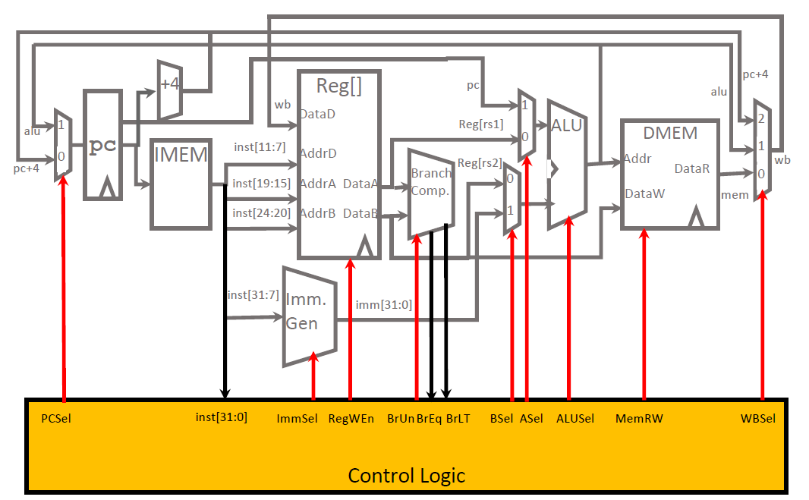
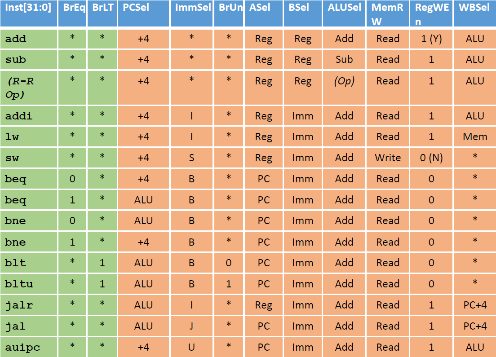
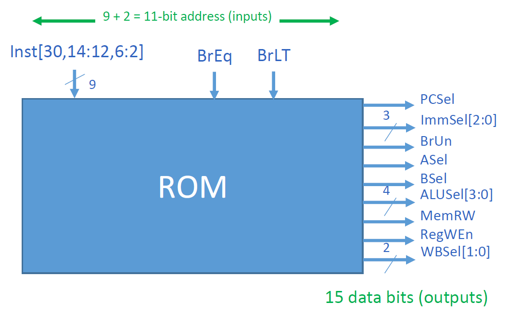
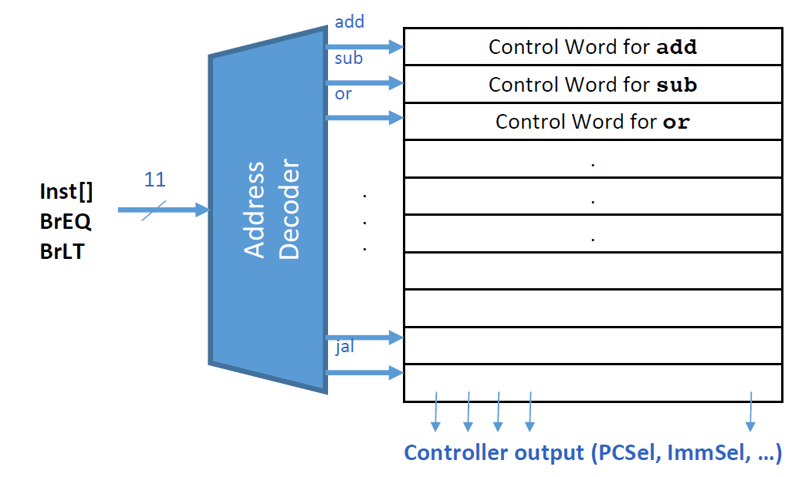
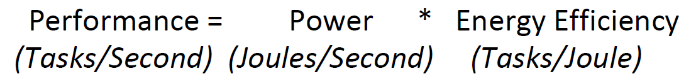
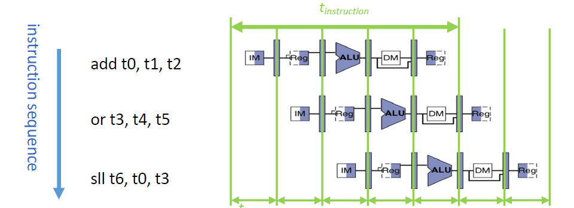
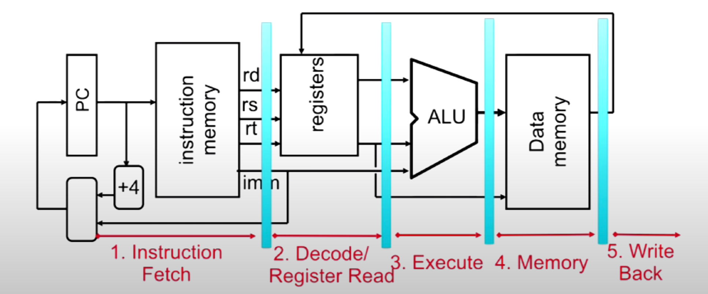
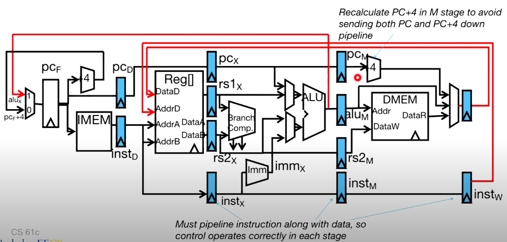
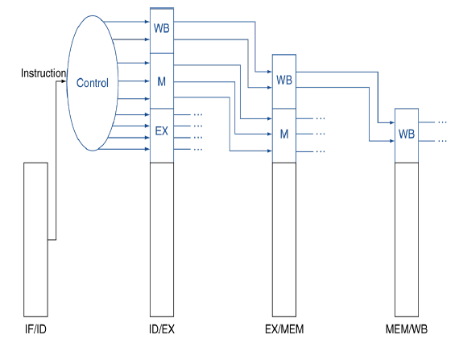

# Lec13: RISC-V CPU Control, Pipelining

## Control Implementation

每个control signal可以设置为可能的值或者一个不确定的值(*)以表示该信号不影响指令执行

每一个control signal有一个基于大约9bit的子电路：

- func7的高位5bit（对于CS61C的指令而言，低位2bit相同）
- func3的3bit
- opcode高位的第二个bit（对于CS61C的指令而言，其它部分都一样）

### Control Construction Options

- ROM
  - 可以看作是一个真值表，输入对应输出
  - 容易重新编程（修正错误和添加新指令）
  - 在人为设计控制逻辑时流行
- Combinational Logic
  - 如今，芯片设计师用逻辑合成工具来将真值表转化为逻辑门网络
  - 不易重新编程，因为需要修改硬件，但更加复杂

#### ROM Based Control

11bit的输入映射到15bit的输出，但指令数量并没有这么多，可以继续简化

首先输入到组合逻辑Address Decoder中判断11bit对应的指令类型，再在表中查到对应的15bit控制信号，表中的条目数等于指令类型数，更加高效

## Performance Analysis

lw指令会用到指令执行的五阶段

- Latency: 程序执行的时间
- Throughput: 单位时间处理的请求数量（指令数量）
- Energy per task: 每个任务所消耗的能量

- 每个程序的指令数取决于对应的任务、算法、编程语言、编译器、ISA和输入

- CPI(Clock cycles Per Instruction)取决于ISA和处理器的实现、复杂指令（如strcpy, CPI > 1）和超标量处理器（CPI < 1）

- 时钟周期的时间长度取决于处理器的关键路径、技术（晶体管等硬件）和功率分配（低电压会降低晶体管的速度）

要减少一个程序的耗能，就要减少单条指令的耗能，这是与CV^2^成正相关的

摩尔定律以及降低供电电压使得耗能减少

供电电压不能一直降低，容易导致功率泄漏，即晶体管出现没有完全打开和关闭的状况

- 对于功率受限的系统（如20MW的数据中心），需要更高的能量效率使得在相同功率的情况下得到更高的性能
- 对于能耗受限的系统（如1W的手机），需要更高的能量效率来延长电池寿命

## Pipelined Execution

- 流水线并不会减少单个任务的延迟，但能增加系统的吞吐量

- 多个任务可以在彼此占用不同资源的情况下同时进行
- 流水线的加速与流水线阶段数有关
- 填充和清空流水线（初始和结尾）会减缓加速
- 流水线的时钟周期受最慢阶段约束，不平衡的划分也会降低效率

## Pipelined Datapath

对于单个指令是顺序执行各个阶段，对于多个指令是在同一时间执行各自的不同阶段

在电路中间插入寄存器，划分出五阶段流水线

### Pipelining with RISC-V

### Pipelined Control

必须将指令信息随着数据传递到各个阶段，控制信号存储在流水线寄存器中

可以选择只传递每个阶段必要的控制信号，也可以直接传递指令

