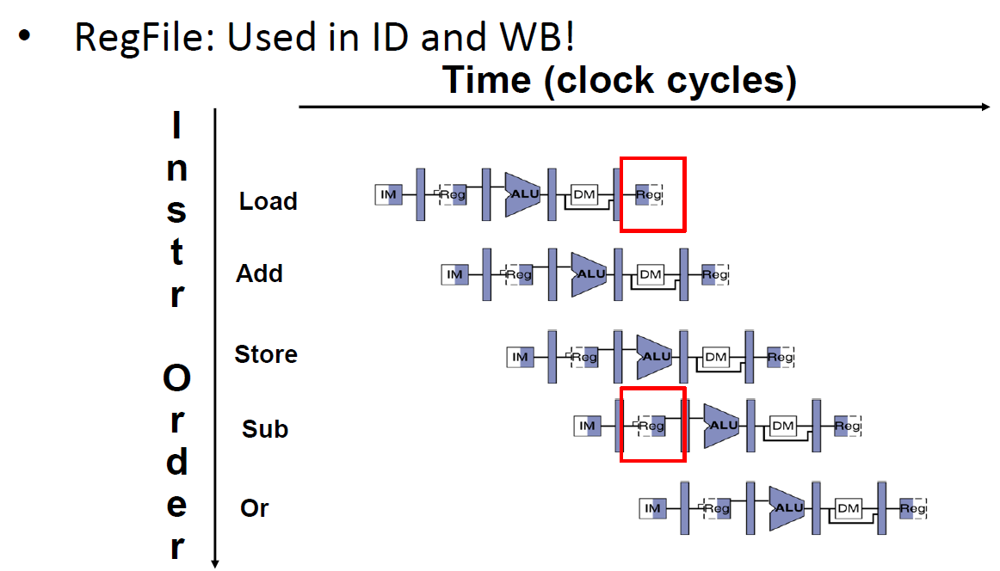
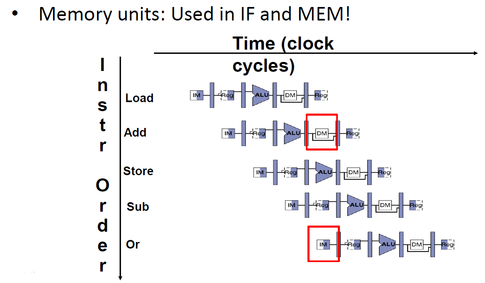
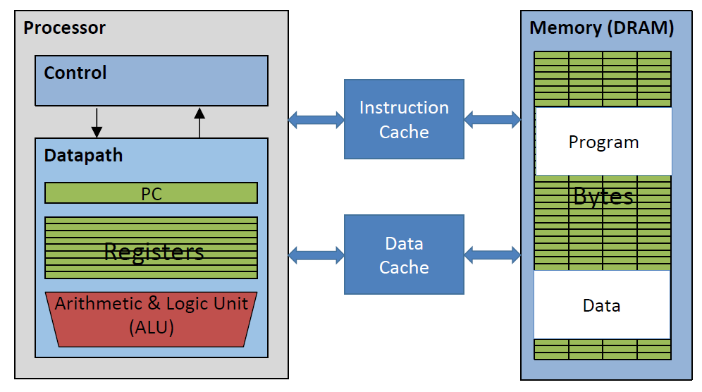
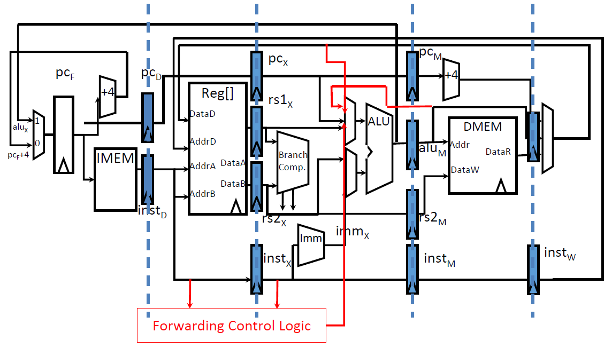
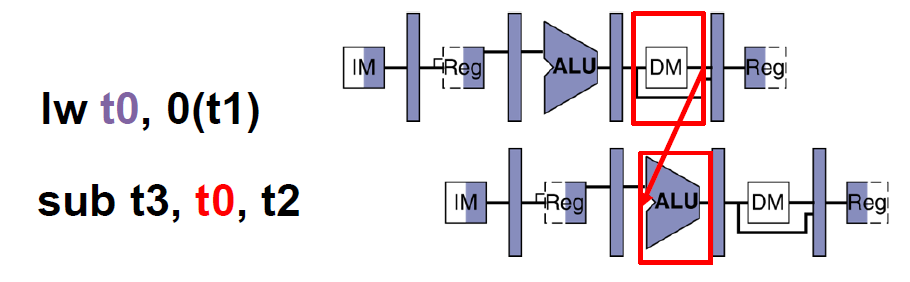
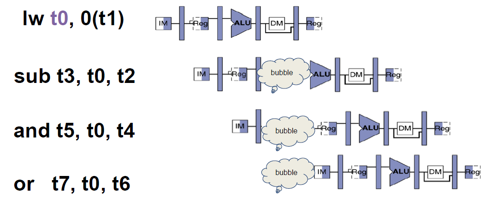
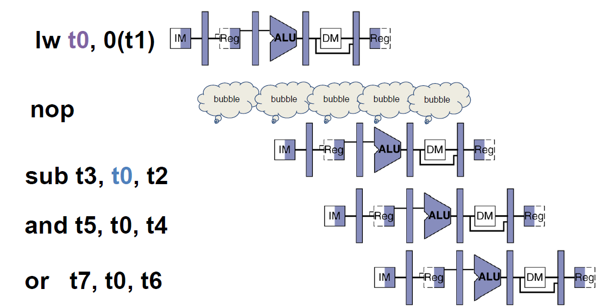
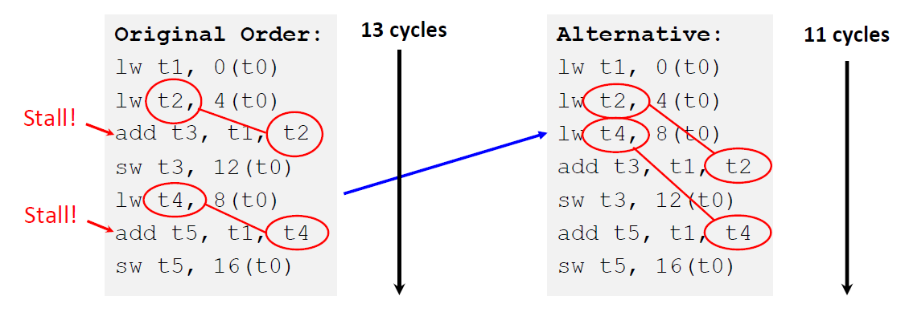
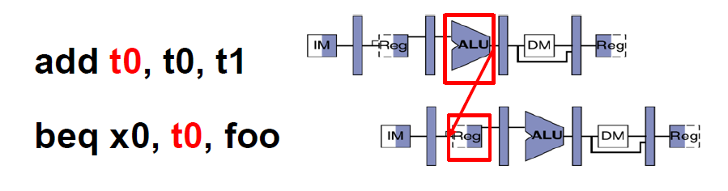
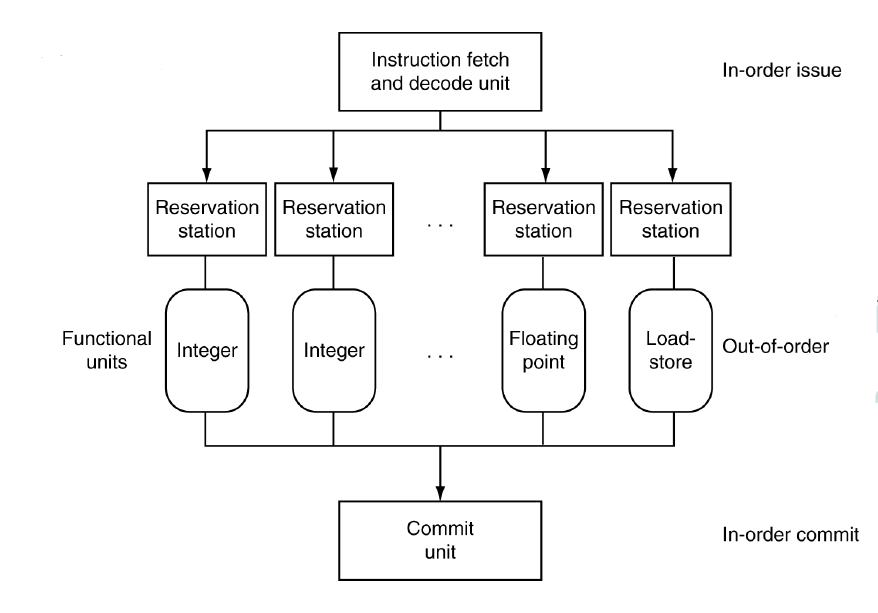

# Lec14: RISC-V Pipeline Hazards

## Hazards

风险指的是可能妨碍下一条指令执行的情况

- Structural hazard
  - 多个阶段需要同一个资源
- Data hazard
  - 指令之间的数据依赖
  - 后一条指令需要等前一条指令完成数据写操作后再继续执行
- Control hazard
  - 指令流依赖于前一条指令执行的结果

### Structural Hazard

流水线上的多条指令竞争访问相同的物理资源

解决方法：

1. 指令轮流访问资源
2. 添加更多的硬件

**Structural hazard永远可以通过增加硬件来解决**

寄存器文件在写回和译码阶段会出现structural hazard

寄存器文件有两个读端口和一个写端口，三者可以同时进行

Double Pumping: 将寄存器文件访问分成两部分，在前半部分准备写操作，**在时钟下降沿写入**（因为寄存器访问速度很快），在后半部分进行读操作

结论：寄存器读写竞争可以解决

内存在访存和取指阶段可能会出现structural hazard

指令和数据对应不同的cache，处理器先在cache中获取，再从内存获取

结论：分离指令和数据的存储单元后，取指和访存阶段不会产生structural hazard，两者相互独立

**RISC ISAs（包括RISC-V）的设计能够避免structural hazard**

## Data Hazard

### R-type Instructions

指令的读取需要之前的指令写入的数据

解决方法：

1. stall（暂停），用气泡暂停2个阶段

   - 流水线吞吐量减小
   - 编译器可以对代码重新排序以避免hazard和stall的发生

2. forwarding(bypassing)，将ALU计算的结果在写回之前传递给后续指令的ALU

   - 需要对datapath进行修改和增加控制信号
   - 需要考虑该指令之后的两条指令，比较当前指令的rd和后一条指令在译码阶段得到的rs
   - 忽略对x0的写操作

   

### Load

加载指令也可能在访存和译码阶段发生data hazard

解决方法（配合forwarding）：

1. 插入气泡（硬件互锁），让后续指令暂停一个时钟周期

2. 暂停，相当于插入一条nop指令
   - 在load指令后面的槽称为load delay slot，理想情况下，编译器或汇编器要将与load无关的指令填入该槽，提高效率
   - 等价于插入nop指令，但实际代码中并没有nop，减少空间占用
   - 性能会因此降低

可以通过改变代码执行顺序来避免暂停

## Control Hazard

control hazard主要来源于分支指令，无法确定指令流的走向

解决方法：

1. 暂停两个时钟周期
2. 将branch comparator移到译码阶段
   - 在译码之后决定PC的新值
   - 优点：只需要暂停一个时钟周期
   - 缺点1：必须在译码而不是执行阶段计算PC + Imm，需要增加新的硬件和逻辑，并且分支指令在后面三个阶段都是空闲的
   - 缺点2：会导致新的hazard，必须暂停一个时钟周期才能解决

3. 预测分支，如果预测正确则正常运行，否则插入气泡取消预测的两条指令，重新执行正确的指令
   - 这是RISC-V的解决方案

### Dynamic Branch Prediction

对于比较深的流水线而言，分支预测的惩罚开销大（浪费两条指令）

动态分支预测：

- 用branch history table存储之前的分支结果
- 执行分支指令时，先检查branch history table以进行预测

分支指令的执行机制有两种：

- Speculative execution: 当流水线猜测需要采用分支时，尽量预测采用分支
- Eager execution: 两种可能性都执行，在得到分支结果后采用正确的分支并舍弃另一分支
  - 这种方式存在巨大的漏洞，例如Intel的Spectre和Meltdown漏洞，可以强制执行任何想执行的代码，放在分支指令后面即可

### Branch Predictors

分支预测非常有效，如今已经有很多分支预测的模型，例如branch target buffer, branch history table, geometric predictors等

local vs. global branching

## Superscalar Processors

目前处理器性能受到的约束：

1. 时钟频率
2. 流水线阶数

超标量处理器有更多的ALU来实现多条指令同时执行，理想状态下CPI < 1

由于CPI < 1，因此用Instructions Per Cycle(IPC)来衡量性能

顺序输入指令，乱序执行，顺序输出结果

硬件会动态重排指令以减少hazard的影响

