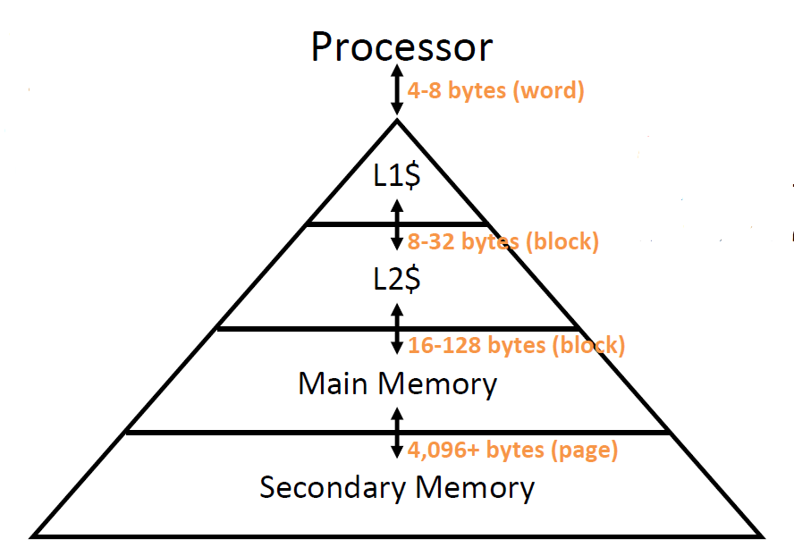
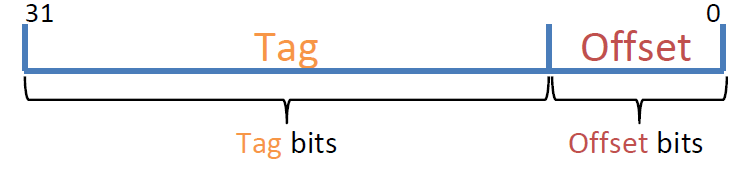
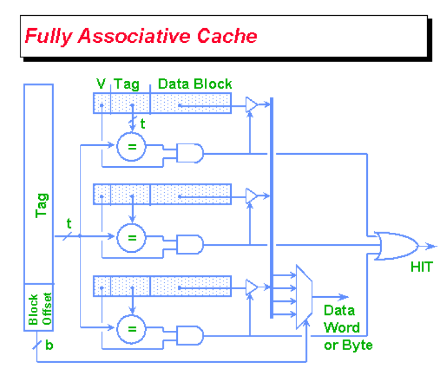
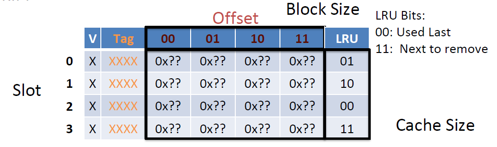
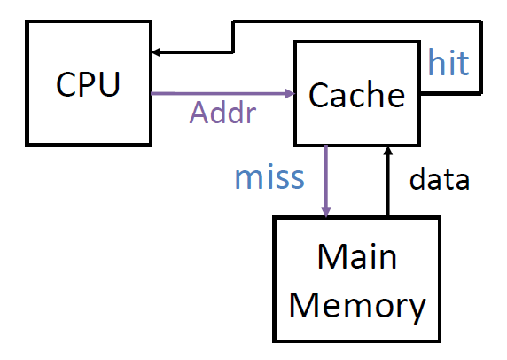
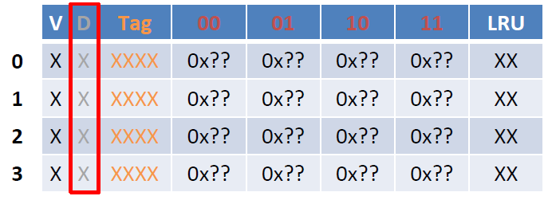

# Lec15: Memory Hierarchy, Fully Associative Caches

## Principle of Locality

循环和顺序执行访问局部的代码区域

栈和堆使得数据放置在局部位置

数组和结构体的数据组织在一起

- 时间局部性(Temporal Locality)：内存某处的数据被访问后很有可能在之后再次被访问
- 空间局部性(Spatial Locality)：内存某处的数据被访问后，其相邻处的内存也可能在之后被访问

## Memory Hierarchy

Register -> Cache -> Memory -> Disk

越接近处理器的存储访问越快，越远离处理器的存储容量越大

目的：创造内存访问速度很快、容量很大的假象

Cache有时简写为$，如D\$ = Data Cache, L1\$ = Level 1 Cache

Cache集成在CPU上，价格昂贵

- register $\leftrightarrow$ memory: 由编译器实现（汇编代码）
- cache $\leftrightarrow$ main memory: 由cache controller hardware控制
- main memory $\leftrightarrow$ disk: 由操作系统和硬件协同完成

### Memory Hierarchy Technologies

- Cache是SRAM，速度快，但更耗电、价格更贵，并且一旦断电数据就消失

- Main memory是DRAM，速度慢，但更省电、价格更便宜，需要周期性刷新（~every 8 ms）

## Fully Associative Caches

由于内存是byte-addressed，cache也要做到byte-addressed

cache中一个block的大小倾向于字大小的倍数，通过offset实现byte-addressed

用index来区分不同“集合”的block，用tag来区分每个block

通过valid bit来确认cache slot的内容是否有用

内存地址的低位用于表示offset，因此block size必须为2的幂

Cache size指的是**所存数据的大小**（C Bytes），可以由此得到cache的block数为C/K（K为block的大小）

对于全相联cache而言，内存地址剩下的bit用于表示tag，每个内存块可以放到全相联cache中的任意位置（空间使用效率高，但查找效率低）

1. 检查每个cache slot
2. 如果valid bit = 0，检查下一个
3. 如果valid bit = 1并且tag匹配，则返回相应数据（Cache必须存储valid bit和tag）

## Hits, Misses and Replacement Policies

最优的替换策略：替换下一次调用距离现在时间最长的块

LRU：替换上一次调用距离现在时间最长的块

- Cache的效率用hit rate(HR)和miss rate(MR)来衡量

- Cache的速度用hit time(HT)和miss penalty(MP)来衡量
  - HT包括tag比较的时间
  - MP指替换所需要的时间

全相联cache的一个cache slot = Valid bit(1 bit) + Tag + 8 \* 2^offset^ + ?（其余用于替换策略的bit）

因此cache的大小为(C/K) \* (8 \* 2^offset^ + Tag + 1 + ?) bits 

LRU占用2 bit时：

## Cache Reads and Writes

Cache分为instruction cache(I\$)和data cache(D\$)

- 两者都能进行读操作
  - Read hit: 直接读取即可，速度最快
- 但只有D\$能进行写操作（假设没有self-modifying code）
  - Write hit: 分为两种情况

1. Write-Through Policy(直写): 将数据写回cache和内存

   - 能保持cache和内存的一致性

   - 速度慢
   - 借助write buffer来并行写入cache和内存，加快速度

2. Write-Back Policy(写回): 先写入cache，直到被替换出cache后才写回内存
   - 允许cache和内存不一致
   - 可以在cache进行多次写，而对内存只进行一次写操作
   - Dirty bit: 标记block是否有被修改过，是否需要写回

### Handle Cache Misses

- Read misses:
  - 暂停指令，从内存读取数据到cache中，重新运行指令
- Write misses:
  - 在内存中更新数据
  - Write Allocate policy: 将内存中更新后的数据写入cache中
  - No Write Allocate policy: 只更新内存的数据，不写入cache

通常而言：

- Write allocate与Write-back配对
  - 两者都是优先处理cache
  - 有利于处理频繁写同一地址处的数据的情况
- No Write allocate与Write-through配对
  - 适合写操作不频繁或写操作随机的情况