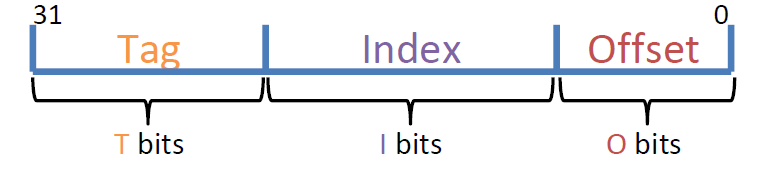
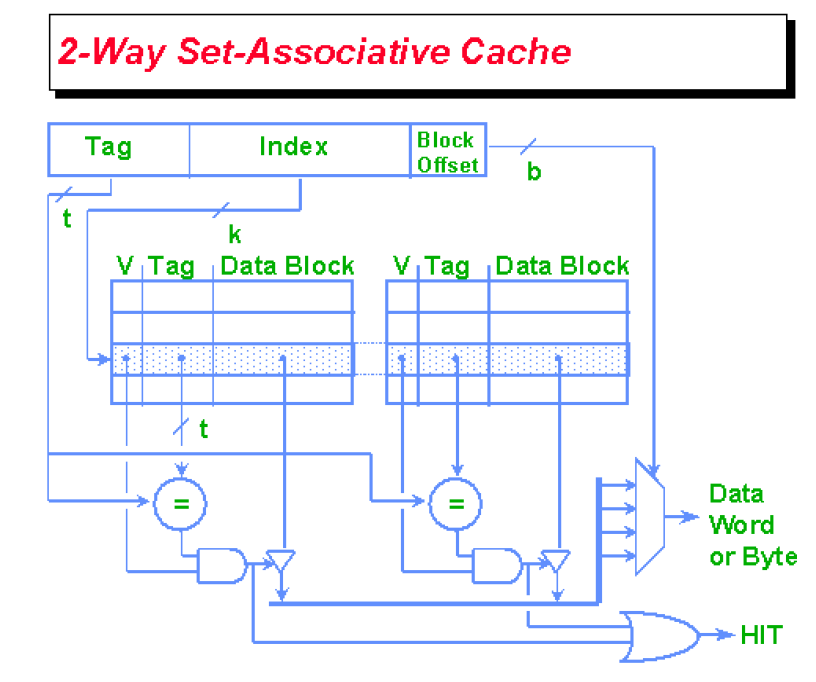
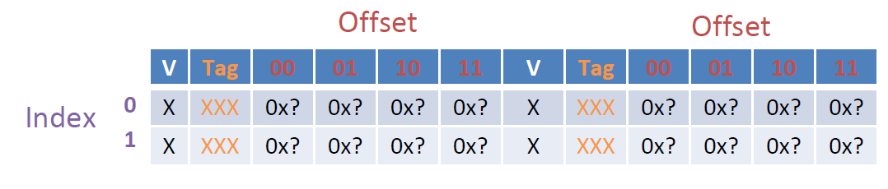

# Lec16: Direct-Mapped and Set Associative Caches

## Direct-Mapped Caches

每个block只能对应一个cache slot

与全相联相比，直接映射只需要检查一个cache slot，速度更快，不需要替换策略，但也存在cache空间利用率不高的可能

- Index field: 确定cache slot的位置
- Offset field: 找到对应的block后读取相应数据
- Tag field: 除去index和offset后剩下的bit，用于区分映射到同一个cache slot的内存地址

cache中存放着数据 + Tag + Valid bit + Dirty bit(for write-back)，没有替换策略的bit

因此Total bits in cache = 2^Index^ \* (Tag + 1 + 1 + 2^Offset^ \* 8) bits

1. 取出index
2. 检查index对应块的valid bit
3. 若valid bit = 1，检查tag是否匹配

### Comparison So Far

- Fully associative
  - 块可以放到任意cache slot
  - 必须检查所有cache slot
  - Tag - Offset
  - 最坏情况下仍然可以填满cache
- Direct-mapped
  - 块只能放到一个cache slot
  - 每次只检查一个cache slot
  - Tag - Index - Offset
  - 最坏情况下只用到一个cache slot

## Set Associative Caches

组相联是全相联和直接映射的折衷

- N-way set-associative: 将cache拆分为多个组，每个组有N个cache slot，Index filed对应组号，一个块可以放到相应组的任意一个slot中
  - N也被称为associativity

1. 取出index
2. 检查index对应组内的每一个cache slot的valid bit
3. 如果valid bit = 1，检查tag是否匹配

N路组相联的最坏情况是先访问N个内存地址，而后不断重复访问第N+1个和第1个内存地址，使得第一个slot被不断替换，此时hit rate = 0

组相联程度决定了块放置的灵活度

