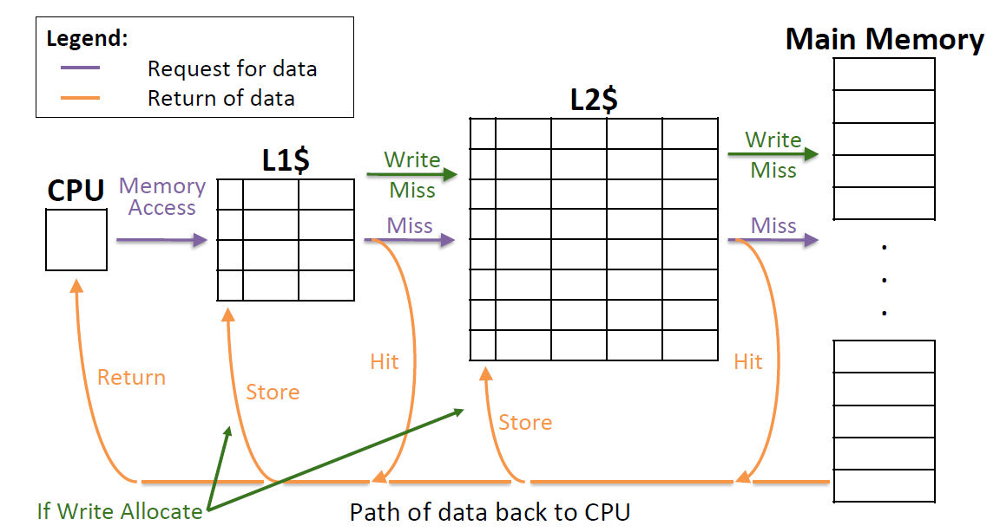
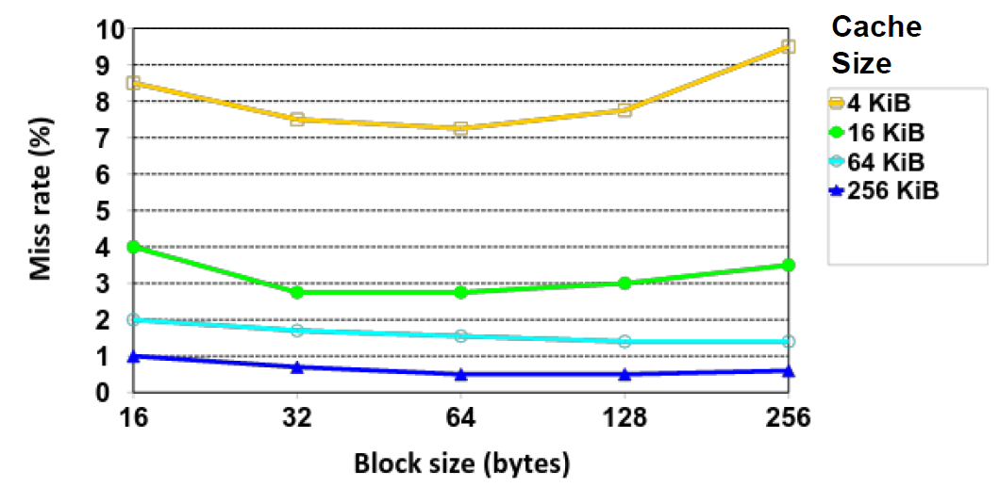
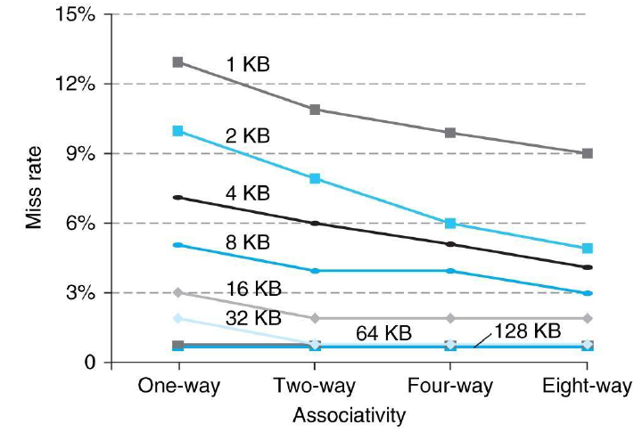
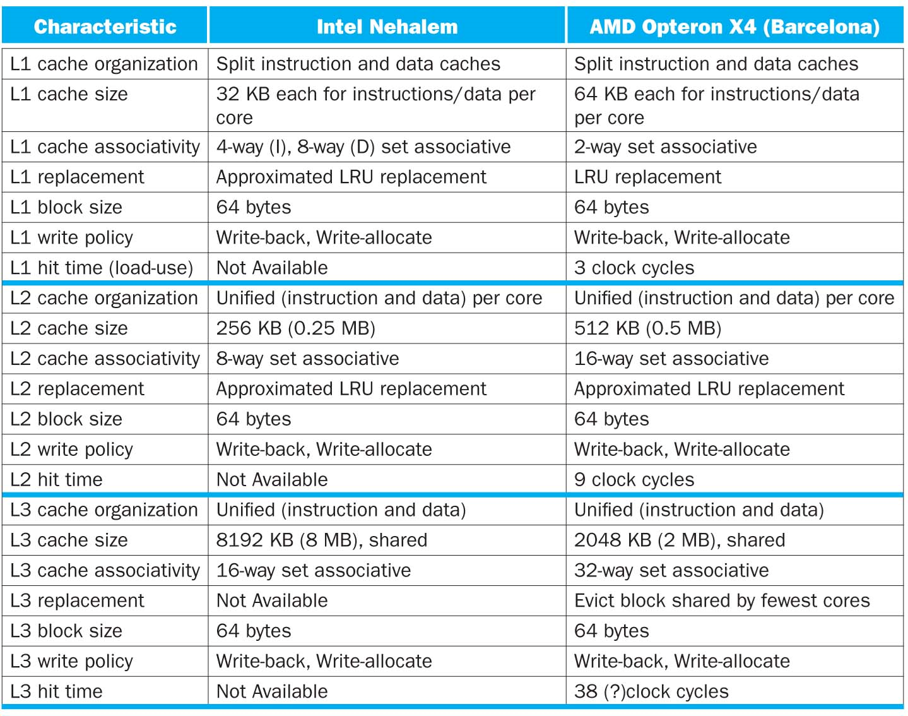

# Lec17: Multilevel Caches, Cache Questions

## AMAT

AMAT = Average Memory Access Time

- AMAT = Hit time + Miss rate \* Miss penalty
  - Hit time: 检查数据是否在cache中的时间
  - Miss penalty: 进入内存所需要的开销（替换）

Hit time的影响因素：

- 查找过程中的比较次数
  - Cache size减小时，hit time减小

- 一般而言，关联度增加会导致hit time增加

Miss rate的影响因素：

- 程序的访问方式
  - e.g. 对二维数组的访问方式
- block size, cache size
  - block size和cache size越大，关联度越高，就能容纳更多数据，访问相邻数据的命中率提高
- 减少miss

Miss penalty的影响因素：

- 内存架构的大小，越往底层请求数据，miss penalty越大
- block size越小，miss penalty越小

### Sources of Cache Misses: The 3Cs

- Compulsory miss(Cole miss): 在程序刚开始运行时，cache为空，第一次访问都是不命中，对于长期运行的程序而言影响小
  - 增加block size，但同时也会增加miss penalty，因为块越大，cache和内存之间传输的开销越大
- Capacity miss: Cache无法容纳程序的工作集，导致miss
  - 增加cache size，但同时也会增加hit time
- Conflict miss: 多个内存地址映射到同一个cache slot或者同一个组中，形成冲突
  - 往往是因为关联度不够高
  - 增加关联度，但同时也会增加hit time

在全相联cache中，conflict miss和capacity miss是等价的，一般称为capacity miss，因为conflict miss能够通过增加关联度来解决

## Multilevel Caches

CPU上有L1, L2, L3三级cache

L1更靠近寄存器文件，L3更靠近内存

多级缓存能够减少miss penalty，选择合适的cache可以减少hit time和miss rate

- L1 Cache更注重低的hit time
  - 目的是实现更小的时钟周期，访问速度加快
  - cache size小，miss rate高

- L2, L3 Cache更注重低的miss rate
  - 目的是减少从内存获取数据的次数，减少惩罚
  - 因此block size更大

### Multilevel Cache AMAT

- AMAT = L1 HT + L1 MR \* L1 MP
- L1 MP = L2 HT + L2 MR \* L2 MP
  - MP~i~ = HT~i+1~ + MR~i+1~ \* MP~i+1~
  - 最后一级的MP是访问内存的时间

### Local vs. Global Miss Rates

- Local miss rate: 该级的miss rate
  - 与计算AMAT时用到的miss rate相同
- Global miss rate: 每一级的miss rate相乘得到全局miss rate
  - Global miss rate < Local miss rate
  - Global miss rate也可以限制在某一级，例如Global MR L2 = L1 MR \* L2 MR

于是AMAT = L1 HT + L1 MR \* (L2 HT + L2 MR \* L2 MP) = L1 HT + L1 MR \* L2 HT + MR~global~ \* L2 MP

## Improving Cache Performance

- Cache parameters:
  - Cache size, block size, associativity
- Policy choices:
  - Write-through vs. Write-back
  - Replacement policy

最优选择是各个参数之间的折衷，取决于实际应用、技术和价格

### Effect of Block and Cache Sizes on Miss Rate

cache size越大，miss rate越小

开始时，随着block size增加，miss rate减小，因为block size增加能减少compulsory miss，利用了空间局部性

但block size太大时，miss rate增加，因为大的block占据了cache过多的空间，无法充分利用空间局部性

### Benefits of Set-Associative Caches

关联度提高能够减少冲突不命中，但关联度越高，实现越复杂，价格越昂贵

