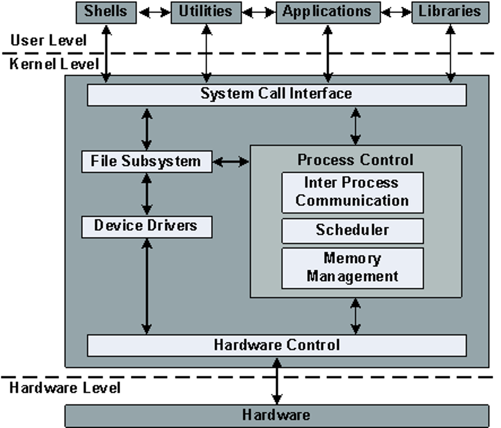
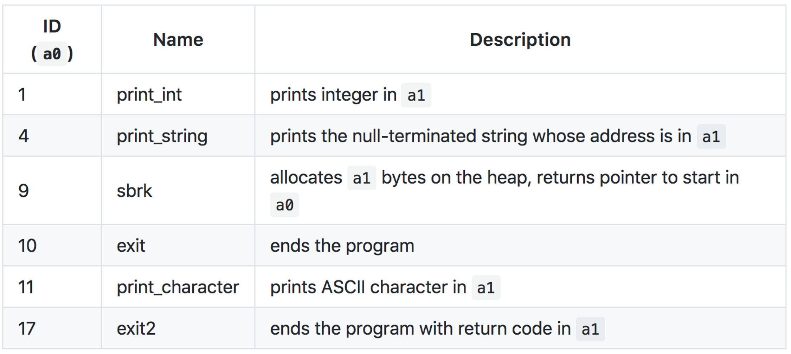
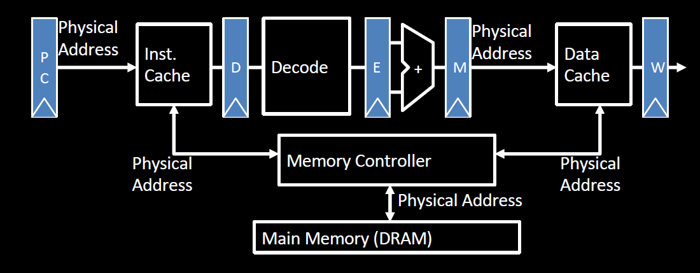
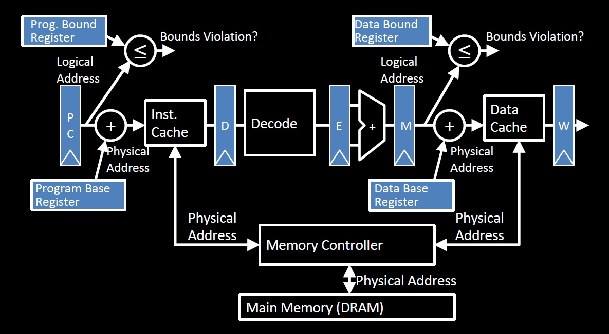

# Lec18: Operating Systems, Virtual Memory Intro

## OS Intro

操作系统控制着软件对硬件资源的访问，构建抽象，提供服务，借助驱动来管理设备

现代操作系统将硬件驱动和文件系统移到用户层，能使系统更加安全和稳定



## OS Boot Sequence and Operation

1. BIOS: find a storage device and load first sector (block of data)

2. Bootloader: Load the OS kernel from disk into a location in memory and jump into it
3. OS Boot: Initialize services, drivers, etc.
4. Init: Launch an application that waits for input in loop (e.g. Terminal/Desktop/...)

### Syscalls in Venus

在Venus中，系统调用通过ecall执行，将系统调用号放在寄存器a0，参数放在a1

ecall的细节取决于ABI(Application Binary Interface)

```assembly
# Print an integer stored in s3
li a0, 1
add a1, s3, x0
ecall
```



More can be found here: https://github.com/ThaumicMekanism/venus/wiki/Environmental-Calls

## Multiprogramming/Time-sharing

操作系统同时运行多个应用程序，借助调度器和上下文切换来实现并发

## Virtual Memory Intro

### Bare 5-Stage Pipeline



### Base and Bound Machine



Base and Bound会有碎片化的问题，并且程序内存空间可扩展性差

### Modern Virtual Memory Systems

- Protection: several programs, each with their private address space and one or more shared address spaces
- Demand paging: provides the ability to run programs larger than the primary memory
- Hides differences in machine configurations

代价在于地址翻译的开销