# Lec19: Virtual Memory

## Virtual Memory and Page Tables

### Page Table Entry Format

- PPN
- Dirty bit
- Valid bit
- Access Rights: Read, Write, Executable
  - 如果不满足，则Protection Fault

### Page Table Layout

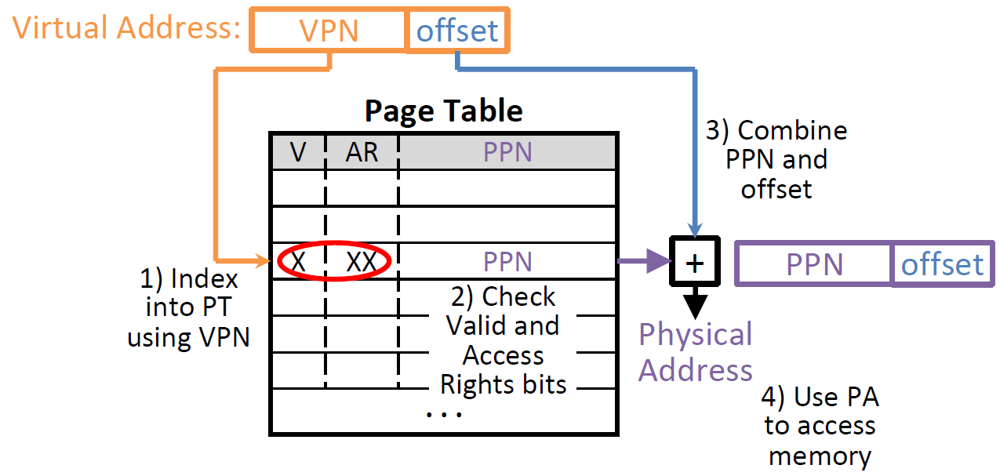

### Private Address Space per User

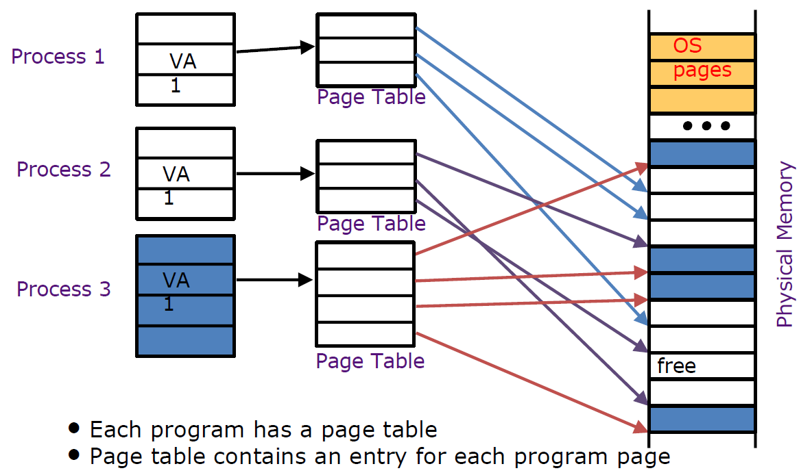

### Linear Page Table

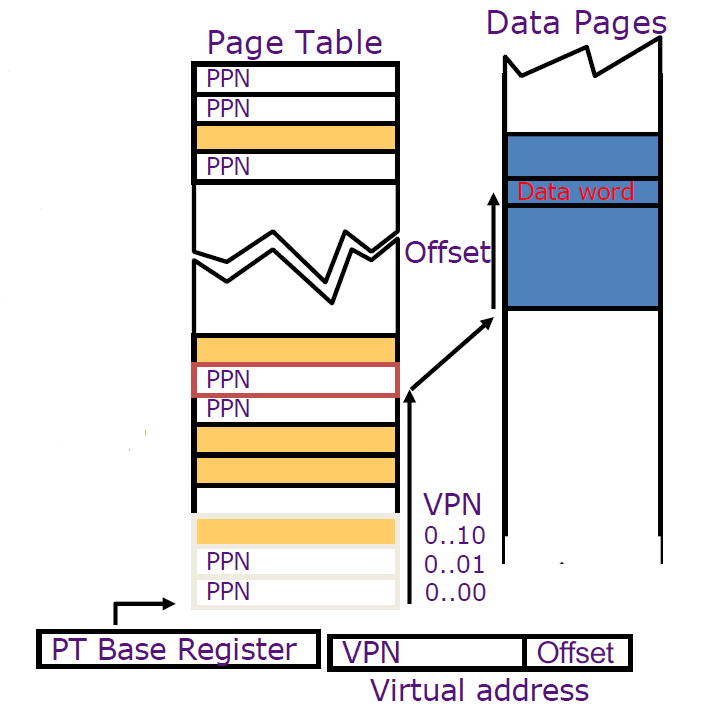

线性页表的缺点在于页表可以扩展得很大，占用空间大

### Hierarchical Page Table

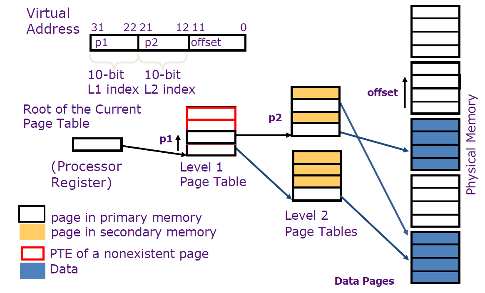

多级页表的一次地址翻译需要多次内存访问

### SPARC v8

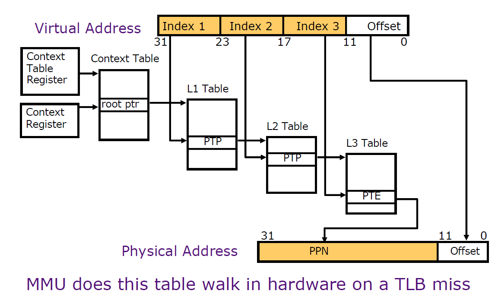

## Translation Lookaside Buffer (TLB)

用地址翻译时，单次获取数据需要多次访问内存，效率低

由局部性知，可能多次访问同一个页内的数据

因此，可以为地址翻译建立一个单独的cache，存储VPN -> PPN的映射关系，称为TLB

### TLB vs. Cache

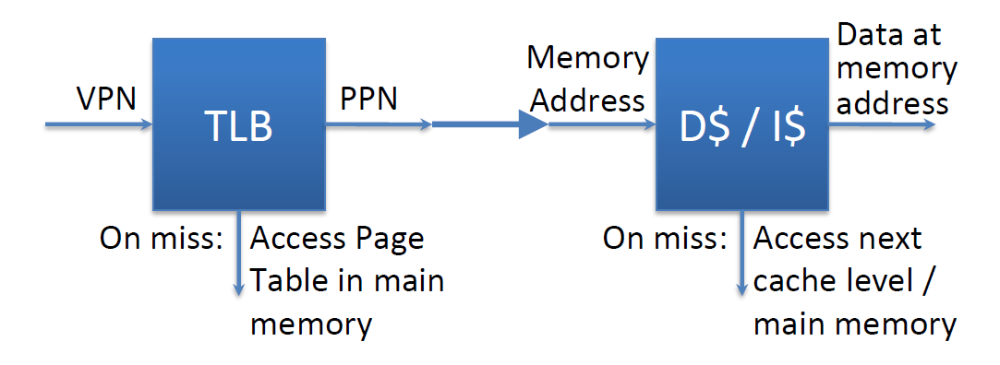

- TLB通常很小，只存有32-128个条目

- TLB的访问时间与cache差不多
- TLB通常是全相联或关联度高的

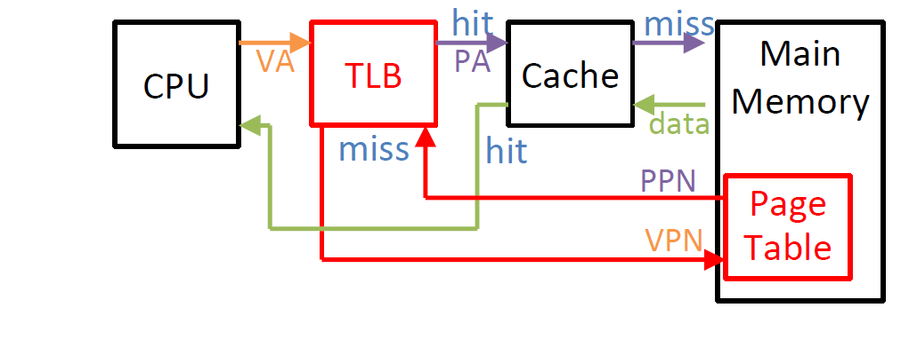

### Typical TLB Entry Format

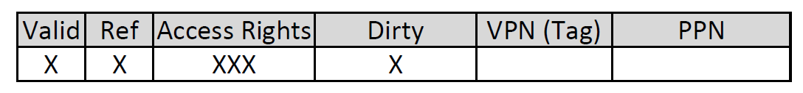

- Valid: whether that TLB entry is valid
- Access Rights: Data from the PT
- Dirty: Consistent with PT
- Ref: Used to implement LRU
  - Set when page is accessed, cleared periodically by OS
- PPN: Data from PT
- VPN: Data from PT

### Fetch Data on a Memory Read

1. Check TLB
   - TLB Hit: Fetch translation, return PPN
   - TLB Miss: Check Page Table
     - Page Table Hit: Load page table entry into TLB
     - Page Table Miss(Page Fault): Fetch page from disk to memory, update corresponding page table entry, then load entry into TLB
2. Check cache
   - Cache Hit: Return data value to processor
   - Cache Miss: Fetch data value from memory, store it in cache, return it to processor

在上下文切换时，TLB中的所有entry都要改为invalid

## VM Performance

### Performance Metrics

- TLB Miss Rate
- Page Table Miss Rate

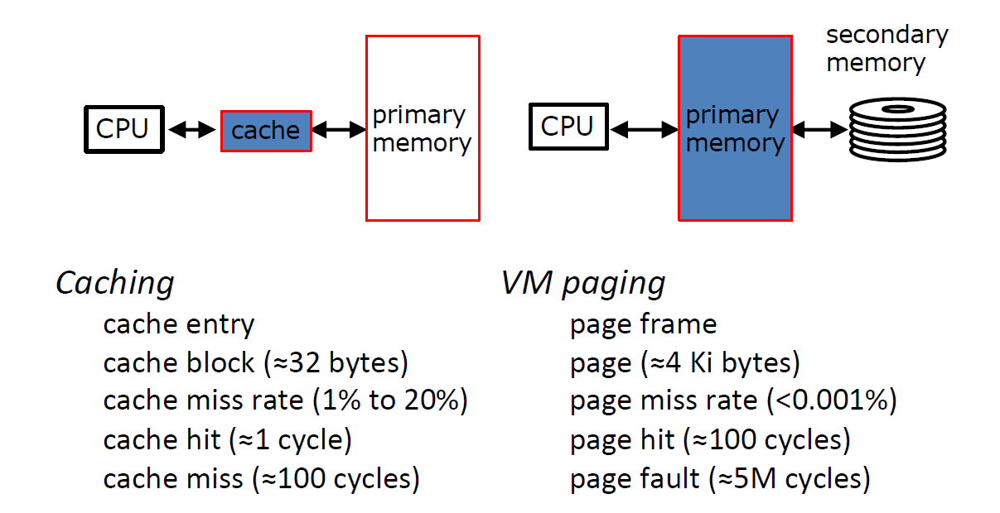

TLB的改进方法：

- Multilevel TLBs
- Variable page size (segments)
- Special situationally-used "superpages"

## VM Wrap-up

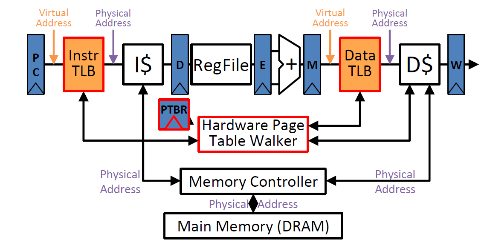

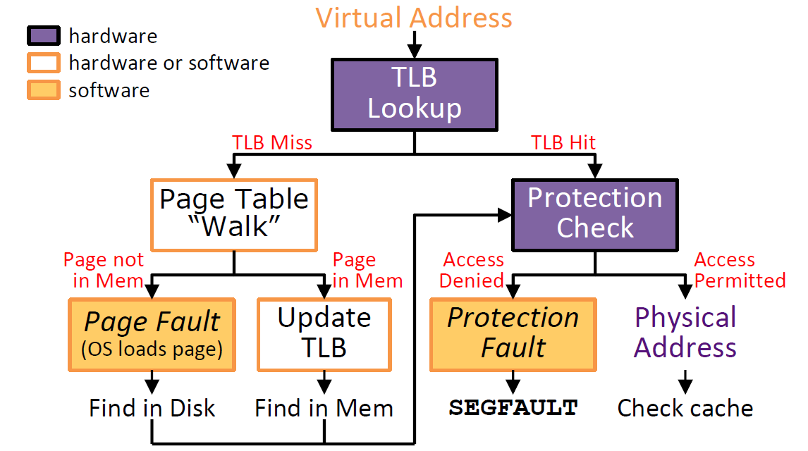