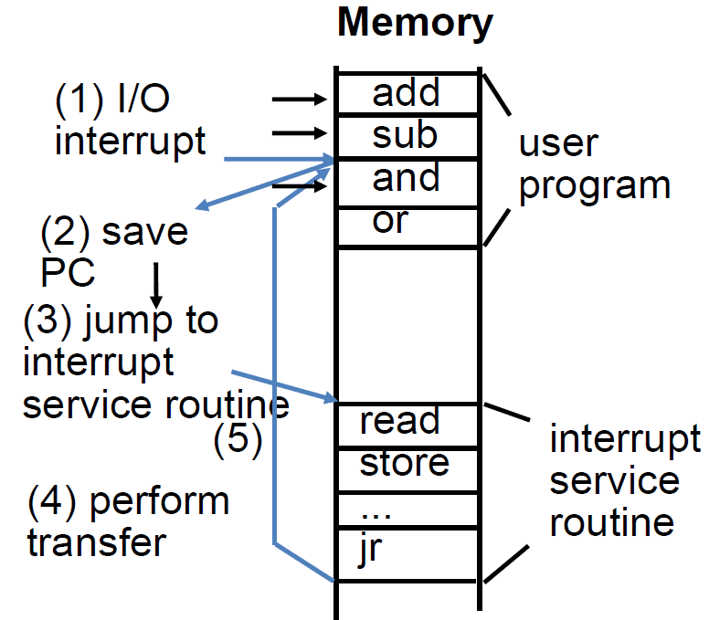

# Lec20: IO

## Disks

### Disk Device Performance

- Average rotation time = 1/2 time of a rotation
- Average seek time = average number of tracks moved \* time to move across one track
  - average number of tracks moved = track number / 3

很多磁盘上有自己的disk cache来加快访问速度

L1 cache -> L2 cache -> L3 cache -> RAM -> Disk cache -> Disk

## SSDs

### Flash Memory Problems

闪存在每次写操作时都要将块擦除后再写，容易磨损

Solutions:

- Apply wear leveling to distribute writes evenly
  - Move frequently written data around
  - Create a map from addresses to real locations
- Lie about how much space you have
  - Sell a 100 GB SSD that secretly has 120 GB
  - Slowly move memory over as sections die

闪存在手机当中很常见


## Communicating with Memory-Mapped I/O

### Instruction Set Architecture for I/O

CISC指令集提供了专门的IO指令

对于RISC-V和ARM等RISC指令集而言，用Memory Mapped Input/Output(MMIO)实现：

- 用load来实现输入，用store来实现输出
- 将一部分内存空间用于IO通信

### Memory-Mapped I/O

部分物理内存区域与IO设备的寄存器关联，作为CPU与IO设备通信的渠道


control register用来表示IO设备是否准备好进行交互

data register用来存储进出IO设备的数据

输入和输出有各自的control reg.和data reg.

### Polling

访问一个IO设备通常经过两个寄存器

- Control register表示是否准备好IO交互
- Data register存储相应数据

Polling:

1. 处理器循环读取control register的值，等待IO设备将ready bit设为1
2. 处理器发起指令将输入从IO设备加载到data register，或将要输出的数据写入data register
   - 将control register的ready bit设为0

```assembly
# Input: Read from keyboard into a0, MMIO at t0
          lui t0, 0xffff # ffff0000
Waitloop: lw t1, 0(t0) # control reg.
          andi t1, t1, 0x1
          beq t1, x0, Waitloop
          lw a0, 4(t0) # data reg.
          
# Output: Write to display from a0
          lui t0, 0xffff # ffff0000
Waitloop: lw t1, 8(t0) # control reg.
          andi t1, t1, 0x1
          beq t1, x0, Waitloop
          sw a0, 12(t0) # data reg.
```

对于1GHz的时钟，一次polling过程需要400个时钟周期

- 鼠标：每秒轮询30次才不会忽略用户的操作
  - Time taken: 30 \* 400 = 12k [clocks/s]
  - % Time: 1.2 \* 10^4^ / 10^9^ = 0.0012%
  - 鼠标操作的轮询对处理器影响小
- 磁盘：每次传输16字节的块，传输速度为16MB/s
  - Freq: 16 [MB/s] / 16[B/poll] = 1M [poll/s]
  - Time taken: 1M \* 400 = 400M [clocks/s]
  - % Time: 4 \* 10^8^ /10^9^ = 40%
  - 在访问小的块时，磁盘操作的轮询对处理器的影响大

### Interrupts

通过中断来通知处理器IO数据传输完毕

#### Exceptions and Interrupts

需要改变指令流的事件

- Exception: 在CPU内产生(syscall, invalid memory access, illegal instruction, overflow error)
  - 同步的，必须立刻对产生异常的指令做对应的处理

- Interrupt: 来自外部IO设备的controller
  - 对当前进程来说是异步的
  - 可以在当前进程方便的时候处理中断，不必马上处理

- Trap: 通过跳转到异常处理程序来处理exception和interrupt的行为
  - Trap handler's view of machine state is that every instruction prior to the trapped one has completed, but that no instruction after the trap has executed.
  - The handler should return by restoring user registers and jumping back to interrupted instruction.
  - Doesn't need to understand any context!

#### Exception Steps

1. Unexpected event occurs
2. Save PC and registers
3. Change PC to trap handler
4. Execute handler code
5. Restore registers and PC

#### How to Save Program State?

用特殊的“硬件”寄存器组Control and Status Registers(CSR)

- 将PC放在"spec" CSR，reason放在"scauce" CSR以便trap handler判断要处理哪一类的异常
- "sscratch" CSR指向保存寄存器和PC的内存位置
- trap handler的地址存在"stvec" CSR中
- 针对CSRs提供了特殊的原子指令
  - csrrw rd, rs, csr
  - 读取csr的旧值并放入rd中，如果rs != 0，则将rs中的值放入csr

#### Exceptions in a Pipeline

考虑处于执行阶段的fadd.s指令

fadd.s x1, x2, x1

1. 防止x1被修改

2. 完成该指令之前的指令（处于访存和写回阶段的指令）

3. 刷新fadd指令以及接下来的指令
4. 保存PC和寄存器
5. 将控制转移给trap handler

#### I/O Interrupt

I/O interrupt是异步的，异步是相对指令执行而言的：

- I/O interrupt不与任何指令相关联，可以在任何指令执行过程中发生
- I/O interrupt不会影响任何指令的完成



IO中断对CPU的影响比Polling小

### Polling vs. Interrupts

- 数据传输频率低时（鼠标、键盘等）
  - 用中断来实现更好，能避免轮询长时间的等待
- 数据传输频率高时（网络、磁盘等）
  - 开始时用中断，接收到数据传输请求后，采用轮询来不断获取数据

中断的缺点在于每次传输的块很小，处理器参与数据传输的整个过程，效率不高

### DMA

Direct Memory Access

设备控制器直接在设备和内存之间传输数据，不需要处理器干涉，只有在每一页数据传输完毕时发起一次IO中断

DMA Engine(DMA Controller)中含有寄存器，由CPU进行修改，包含了：

- 放置数据的内存位置
- 传输字节数
- 读/写数据的IO设备编号、数据传输的方向
- 传输数据的单位和次数

#### Programmed I/O(PIO) vs. DMA


PIO中CPU先从磁盘获取数据，再传回内存

DMA中直接将数据传给内存，不需要CPU参与

#### Operation of a DMA Transfer


#### DMA: Incoming Data

1. 接收来自IO设备的中断
2. CPU处理中断，开始传输
   - 对DMA Controller中的寄存器进行相应的修改

3. DMA Controller处理数据传输
4. 完成后，DMA Controller向CPU发中断

#### DMA: Outgoing Data

1. CPU初始化传输，确认外部设备准备好进行传输
2. CPU开始传输
   - 对DMA Controller中的寄存器进行相应的修改
3. DMA Controller处理数据传输
4. 完成后，DMA Controller向CPU发中断

#### DMA Problems

DMA通常不涉及cache部分，这样不会影响cache的内容，但可能出现cache和内存不一致的情况


如果将DMA Controller看作一个处理器的话，可以用多核处理器的形式处理cache一致性问题

#### Arbitrate between DMA and CPU

DMA和CPU可以独立访问相同的内存，需要区分出来

- Burst mode
  - 当DMA开始传输数据时，CPU不能同时访问内存
- Cycle Stealing mode
  - DMA Controller传输部分数据后释放对内存的控制，过一段时间重新获取对内存的控制，如此往复，CPU可以在间隙中访问内存

- Transparent mode
  - DMA只有在CPU不使用系统总线的时候可以传输数据

## GPIO

General Purpose IO

芯片上有很多pin可以设置为高或低，通过读取这些pin上的值来获取信息

### Embedded I/O

与外界交互最简单的方法就是通过数字信号

许多嵌入式设备通过按钮和LED来实现交互
