# Lec21: Flynn's Taxonomy and Data-level Parallelism

## Parallelism and Flynn's Taxonomy

### Single Instruction/Single Data Stream

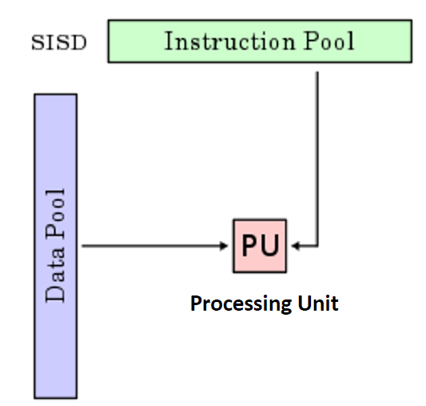

SISD，单处理器机器，没有任何并行

### Multiple Instruction/Single Data Stream

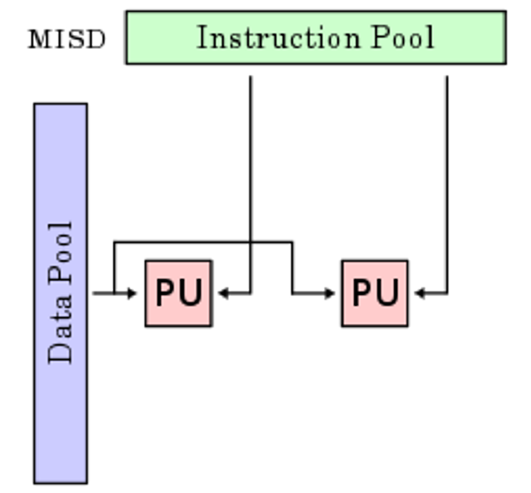

MISD，多个处理器（array processors）并行处理同一个数据流，现在基本没有这样的机器

### Single Instruction/Multiple Data Stream

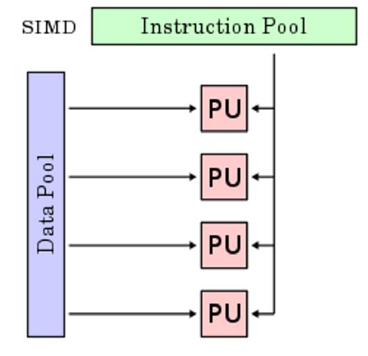

SIMD，用同一个指令流并行处理多个数据流，例如SIMD指令扩展（向量指令）、图形处理单元等

### Multiple Instruction/Multiple Data Stream

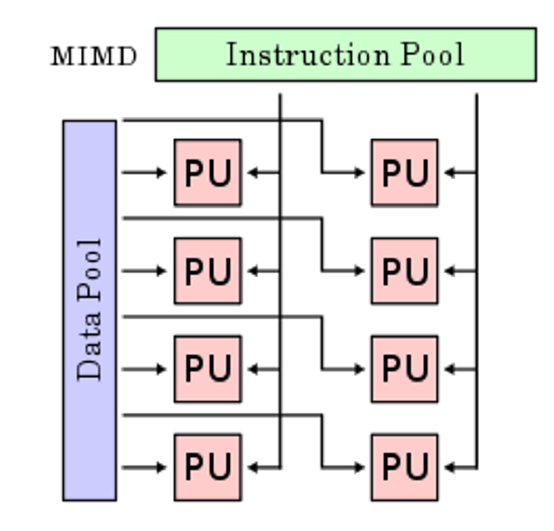

MIMD，多个独立处理器同时处理各自的指令流和数据流，出现在多核情况

### Classes of Data-Level Parallelism

Flynn's Taxonomy:

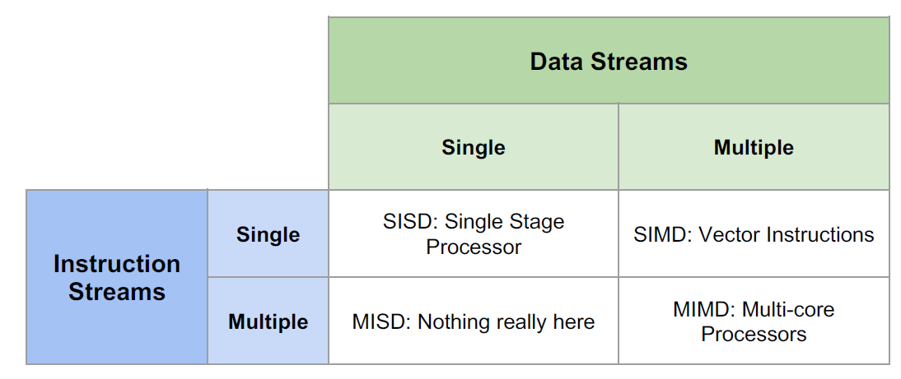

## SIMD Architectures

Data-Level Parallelism(DLP): 对多个数据流执行同一个指令流，例如向量计算

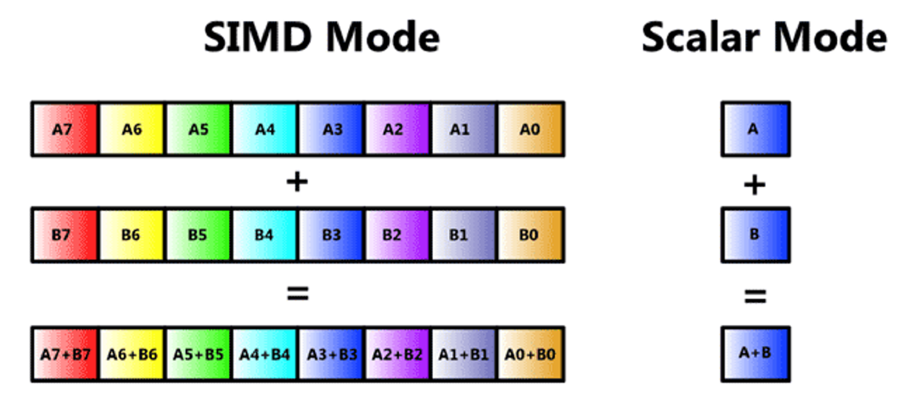

SIMD在图形处理、科学计算、深度学习等领域都有应用，在x86, ARM, RISC-V vector extensions, Video cards24中得到实现

### AVX SIMD Registers

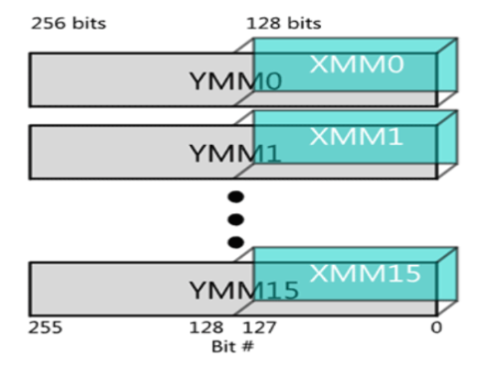

一个256bit的寄存器可以划分为8个float或者4个double

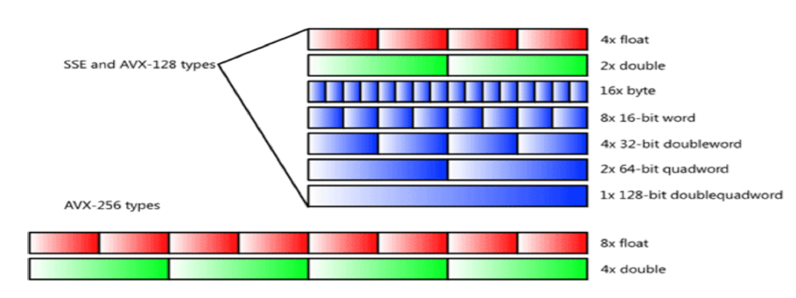

目前的编译器能够生成SIMD代码，但有时候人工编写的代码效率更高

### Intel SSE Intrinsics

内联函数是C语言中能翻译成汇编指令（包括SSE指令）的函数或过程，可以通过内联函数来间接使用汇编指令

内联函数与SSE指令是一一对应的，调用内联函数相当于执行一条汇编指令

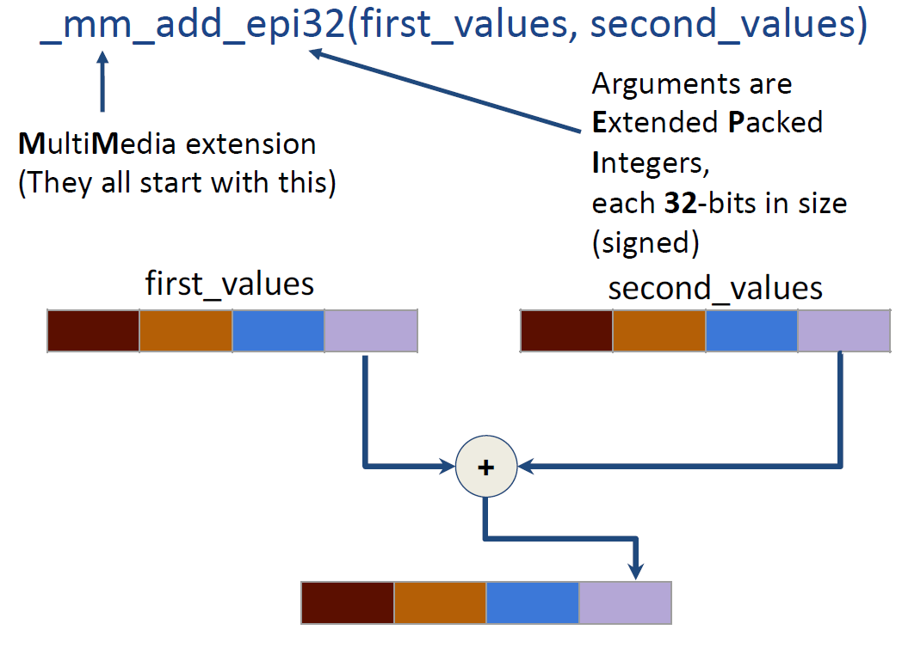

### x86 Intrinsics AVX Data Type

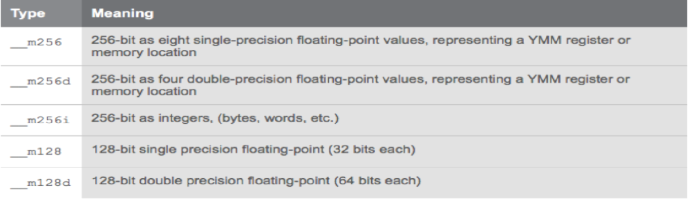

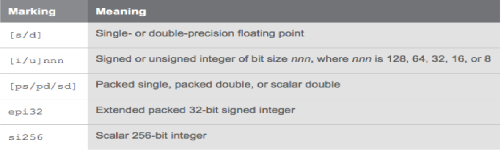

scalar只用到低位的若干位，packed会将若干个数压缩在一个寄存器内

- Arithmetic:

  - `__m128i _mm_and_si128(__m128i a, __m128i b)`:
    - Perform a bitwise AND of 128 bits in a and b, and return the result.

  - `__m128i _mm_add_epi32(__m128i a, __m128i b)`:
    - Return vector(a~0~ + b~0~, a~1~ + b~1~, a~2~ + b~2~, a~3~ + b~3~)

- Load and store operations:
  - `void _mm_storeu_si128(__m128i *p, __m128i a)`:
    - Store 128-bit vector a at pointer p.
  - `__m128i _mm_loadu_si128(__m128i *p)`:
    - Load the 4 successive ints pointed to by p into a 128-bit vector.

- Compare:
  - `__m128i _mm_cmpeq_epi32(__m128i a, __m128i b)`:
    - The ith element of the return vector will be set to 0xFFFFFFFF if the ith element of a and b are equal, otherwise it'll be set to 0.

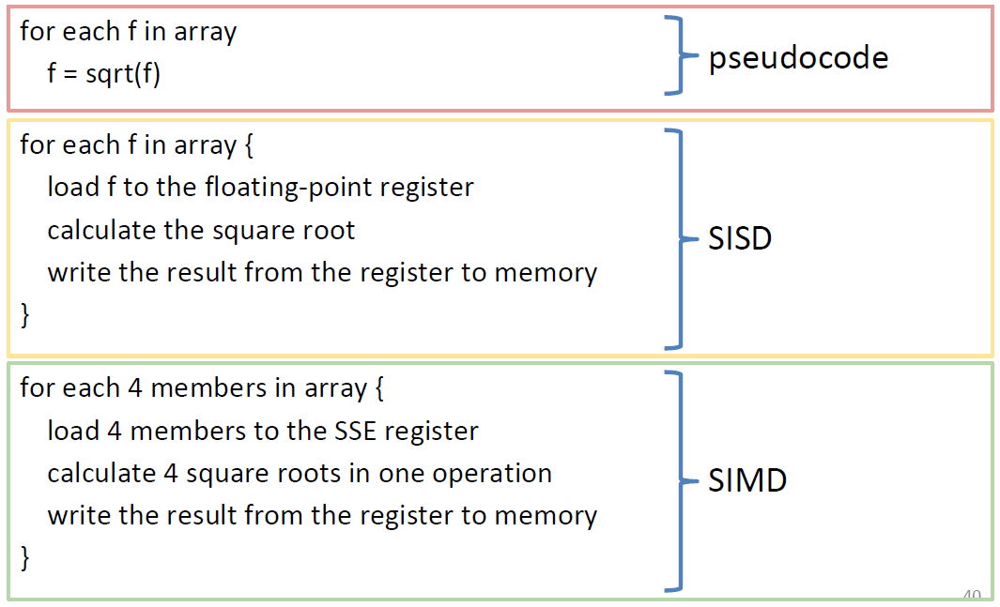

Code exapmle:

```c
int add_no_SSE(int size, int *first_array, int *second_array) {
	for (int i = 0; i < size; ++i) {
		first_array[i] += second_array[i];
	}
}

int add_SSE(int size, int *first_array, int *second_array) {
	for (int i=0; i + 4 <= size; i+=4) { // only works if (size%4) == 0
		// load 128-bit chunks of each array
		__m128i first_values = _mm_loadu_si128((__m128i*) &first_array[i]);
		__m128i second_values = _mm_loadu_si128((__m128i*) &second_array[i]);
	
		// add each pair of 32-bit integers in the 128-bit chunks
		first_values = _mm_add_epi32(first_values, second_values);
	
		// store 128-bit chunk to first array
		_mm_storeu_si128((__m128i*) &first_array[i], first_values);
    }
    ...
}
```

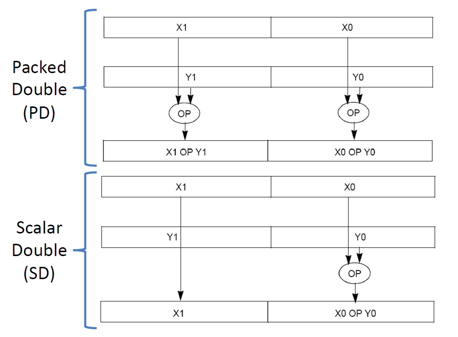

2 \* 2矩阵乘法也可以使用SIMD指令，见lec21.pdf - P50.

## Loop Unrolling

循环展开：n次的循环可以按k个一组进行划分，循环体本身至少进行floor(n/k)次，余数部分单独处理

循环展开的缺点在于会增加代码量，并且k依赖于寄存器数量

编译器也可以进行循环展开

其它代码优化：将循环中不变的部分移到循环外
