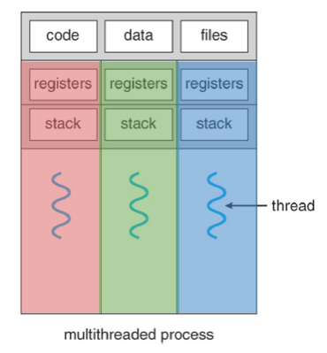
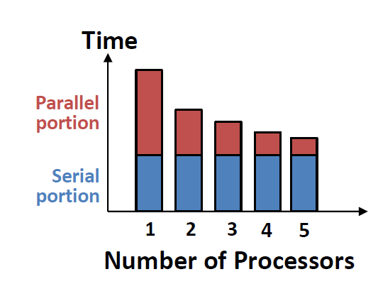
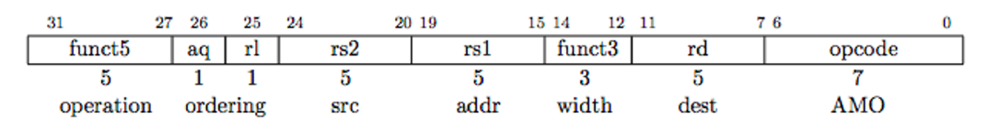
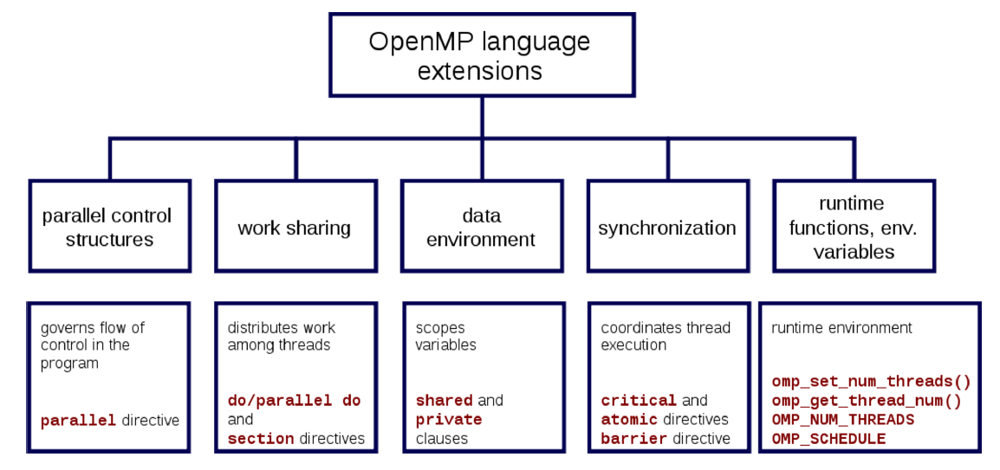
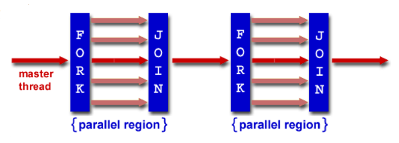
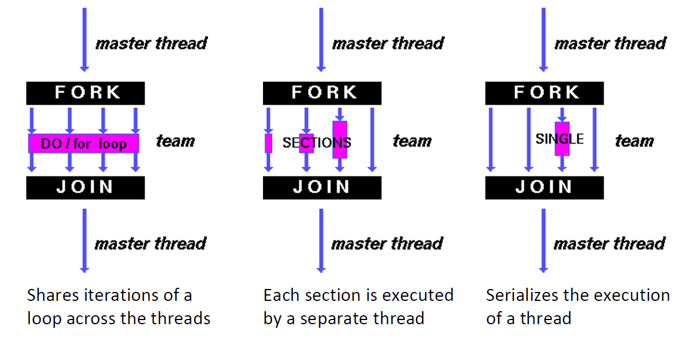

# Lec22: Amdahl's Law and Thread Level Parallelism

## Parallel Computing

线程有独立的寄存器、PC、栈，线程之间共享代码段、数据段、堆和文件描述符



### Multithreading vs. Multicore

- 多线程的优点在于提高CPU的利用率
  - 5% more hardware, 1.30X better performance
  - 共享ALU, cache, memory controller
- 多核的优点在于有更多的CPU
  - 50% more hardware, 2X better performance
  - 共享L2 cache, L3 cache, memory controller

## Parallelism Challenges

并行对进程的加速可能只体现在进程的一部分

### Amdahl's Law

- Speedup = $\frac{1}{(1-F)+F/S}$
  - F = Fraction of execution time speed up
  - S = Scale of improvement

Amdahl's law可以得出加速的程度受限于程序的非并行部分

要想实现成倍的加速，必须让所有部分都并行



## Synchronization

硬件提供的同步机制：

- Atomic swap of register and memory
- Pair of instructions for "linked" read and write

### RISCV Atomic Memory Operations(AMOs)

AMOs对某一内存地址的值进行操作，并将原始值存到rd寄存器中

形如R-type指令格式：



```c
amoadd.w rd, rs2, (rs1):
	temp = M[R[rs1]];
	R[rd] = temp;
	M[R[rs1]] = temp + R[rs2];
```

### Memory Ordering

由于流水线的指令可能是乱序的，对内存的操作需要排序执行，保证同步

- aq - acquiring lock
  - 在这条指令执行完之前，其它指令不能访问内存
- rl - releasing lock
  - 先完成其它所有访问内存的指令，再完成该指令

```assembly
	 addi t0, x0, 1			   # Get 1 to set lock
Try: amoswap.w.aq t1, t0, (a0) # t1 gets old lock value
							   # while we set it to 1
	 bnez t1, Try 			   # if already 1, another thread has
	 						   # lock, so we must try again
	 … critical section goes here …
	 amoswap.w.rl x0, x0, (a0) # store 0 in lock to release
```

## OpenMP

OpenMP是用于共享内存的多线程的API，具有可移植和标准化的优点

- Compiler Directives
  - 告诉编译器应该做什么
- Runtime Library Routines
  - 运行时库
- Environment Variables
  - 为该运行时库设置的环境变量

Resources: http://www.openmp.org and http://computing.llnl.gov/tutorials/openMP/

### OpenMP Specification



OpenMP是一个基于显式线程并行的共享内存模型，程序员对并行有完全的控制权

- 优点：
  - 可以充分利用共享内存，不需要担心数据存储的问题
  - 编译器指令简单易用
  - 遗留的串行代码不需要大规模重写

- 缺点：
  - 代码只能在共享内存环境下运行
  - 编译器必须支持OpenMP(gcc 4.2)

要使用OpenMP，必须#include <omp.h>，在编译时加上gcc -fopenmp

Key ideas:

- Shared vs. Private variables
- OpenMP directives for parallelism, work sharing and synchronization

### OpenMP Programming Model

Fork - Join Model

主线程的TID = 0



### OpenMP Extends C with Pragmas

Pragmas是C语言为语言扩展提供的预处理器机制，例如structure packing, symbol aliasing, floating point exception modes等

编译器在编译时会忽略pragmas，使得OpenMP代码被顺序执行

#### Parallel Pragma and Scope

```C
#pragma omp parallel
{   //MUST go on separate line from #pragma
	/* code goes here */
}
```

每个线程都会运行一份该代码块的拷贝

在pragma外的变量都是共享的，如果想将某变量设为私有，则要在pragma内声明，或者用private(x)表示变量x是私有的

`#pragma omp parallel private(x)`

#### Thread Creation

能创建的线程数取决于环境变量`OMP_NUM_THREADS`，将该变量设置为所需要的线程数，通常等于内核数

- `omp_set_num_threads(x)`
  - 将线程数设置为x
- `omp_get_num_threads()`
  - 获取线程数量
- `omp_get_thread_num()`
  - 获取线程ID

Code example:

```C
#include <stdio.h>
#include <omp.h>
int main () {
	int nthreads, tid;
	/* Fork team of threads with private var tid */
	#pragma omp parallel private(tid)
	{
		tid = omp_get_thread_num(); /* get thread id */
		printf("Hello World from thread = %d\n", tid);
		/* Only master thread does this */
		if (tid == 0) {
			nthreads = omp_get_num_threads();
			printf("Number of threads = %d\n", nthreads);
		}
	} /* All threads join master and terminate */
}
```

### OpenMP Work Sharing

在并行部分，不同线程可以做不同的工作



```C
#pragma omp parallel
{
	#pragma omp for
	for(i=0;i<len;i++){...}
}
/* can be shortened to */
#pragma omp parallel for
	for(i=0;i<len;i++){...}
```

可以将for循环自动拆分成多个块，分给不同的线程来处理，但也有相应的限制：

- 运行时系统必须能确定多少次循环迭代被分配给每个线程
- for循环中不能存在提前退出循环的情况（即break, return, exit, goto等语句）
- 循环不能是do while循环或者是没有控制的循环
- 循环迭代变量必须是整数，并且所有线程的循环控制参数必须相同

划分的块通常是连续的，因为当一个线程运行时会invalidate其它线程的cache line

- 如果两个线程没有修改相同内存位置的值，但由于上下文切换导致另一个线程的cache line invalid，则称为false sharing

- 如果两个线程会修改相同内存位置的值，则上下文切换导致另一个线程的cache line invalid是有意义的，则称为true sharing

缓存模块化能够加快平均内存访问时间