# Lec23: Multithreading Issues, Cache Coherency

## OpenMP Directives

### Matrix Multiply

```C
start_time = omp_get_wtime();
#pragma omp parallel for private(tmp, i, j, k)
	for (i=0; i<Mdim; i++){
		for (j=0; j<Ndim; j++){
			tmp = 0.0;
			for( k=0; k<Pdim; k++){
				/* C(i,j) = sum(over k) A(i,k) * B(k,j)*/
				tmp += *(A+(i*Pdim+k)) * *(B+(k*Ndim+j));
			}
			*(C+(i*Ndim+j)) = tmp;
		}
	}
run_time = omp_get_wtime() - start_time;
```

### Cache Blocking

当N < block size时，miss rate会增加；当N > block size时，剩余部分的数据不会被利用到

因此要尽可能用block size作为步长来划分，提高cache的hit rate

### OpenMP Reduction

下述代码中存在竞争问题，可以通过在各个线程中设置私有变量进行求和，最后合并

```c
double compute_sum (double *a, int a_len){
	double sum = 0.0;
	#pragma omp parallel for
	for (int i = 0;i < a_len ;i++){
		sum += a[i];
	}
	return sum;
}
```

- Reduction: 指定一个或多个线程私有的变量var, 在并行的最后部分执行operation
  - reduction(operation : var)
    - operation: perform on the variable at the end of the parallel region
    - var: variables on which to perform scalar reduction

Code example:

```c
double compute_sum (double *a, int a_len){
	double sum = 0.0;
	#pragma omp parallel for reduction(+ : sum)
	for (int i = 0;i < a_len;i ++){
		sum += a[i];
	}
	return sum;
}
```

## Common OpenMP Pitfalls

- Data dependencies
- Sharing issues(private/non-private variables)
- Updating shared values
- Parallel overhead

### Data Dependencies

```c
a[0] = 1;
for(i=1;i<5000;i++)
	a[i] = i + a[i-1];
```

在迭代之间存在数据依赖，该循环无法简单拆分，并且乱序执行可能会导致错误的行为

### Sharing Issues

```c
#pragma omp parallel for private(temp)
	for(i = 0;i < n;i++){
		temp = 2.0*a[i];
		a[i] = temp;
		b[i] = c[i]/temp;
	}
```

对于不同的i，用的是相同的temp，因此temp必须为私有

### Updating Shared Values

```C
for(i=0;i<n;i++)
	sum = sum + a[i];
```

sum是共享变量，可以通过同步机制或reduction来解决

```c
#pragma omp parallel for reduction(+:sum)
{
	for(i=0;i<n;i++)
		sum = sum + a[i];
}
```

编译器可以为reduction生成非常高效的代码

### Parallel Overhead

生成和释放线程都有相应的开销，因此希望有较少的线程工作于大的并行块

```c
start_time = omp_get_wtime();
for (i=0; i<Ndim; i++){
	for (j=0; j<Mdim; j++){
		tmp = 0.0;
		#pragma omp parallel for reduction(+:tmp)
			for( k=0; k<Pdim; k++){
				/* C(i,j) = sum(over k) A(i,k) * B(k,j)*/
				tmp += *(A+(i*Ndim+k)) * *(B+(k*Pdim+j));
			}
		*(C+(i*Ndim+j)) = tmp;
	}
}
run_time = omp_get_wtime() - start_time;
```

该代码块的并行部分生成过多线程，生成线程的开销大

## Multiprocessor Cache Coherence

每个核有自己独立的一个cache，自己的cache miss后才去共享的内存区域获取数据

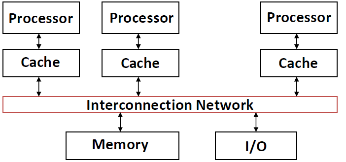

但有可能存在某个CPU修改了内存的某个位置的值，而其它CPU的cache中存储的是旧值

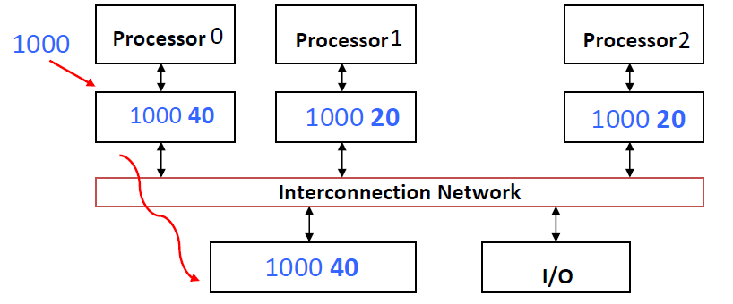

因此，要保持cache与共享内存的一致性

- Idea: on cache miss or write, notify other processors via interconnection network
  - If reading, many processors can have copies
  - If writing, invalidate all other copies

## Coherence Protocol: MOESI

### MSI

每个cache block有相应的状态：

- Modified: 被修改过的块，可以写回内存
  - 与其它cache的拷贝不同
  - 内存中存的是旧值
  - 当其它CPU对该内存地址处的值发起读请求时，必须更新内存来响应请求

- Shared: 尚未进行过写操作的共享数据
  - 与内存中的值相同

- Invalid: 无效数据

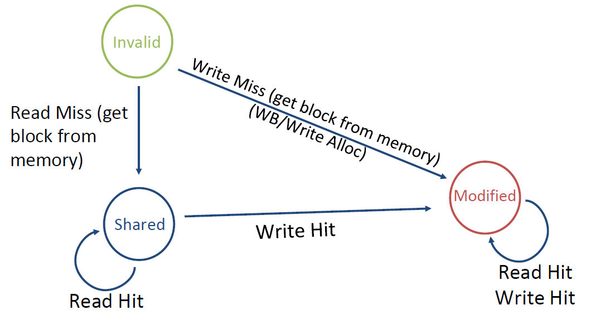

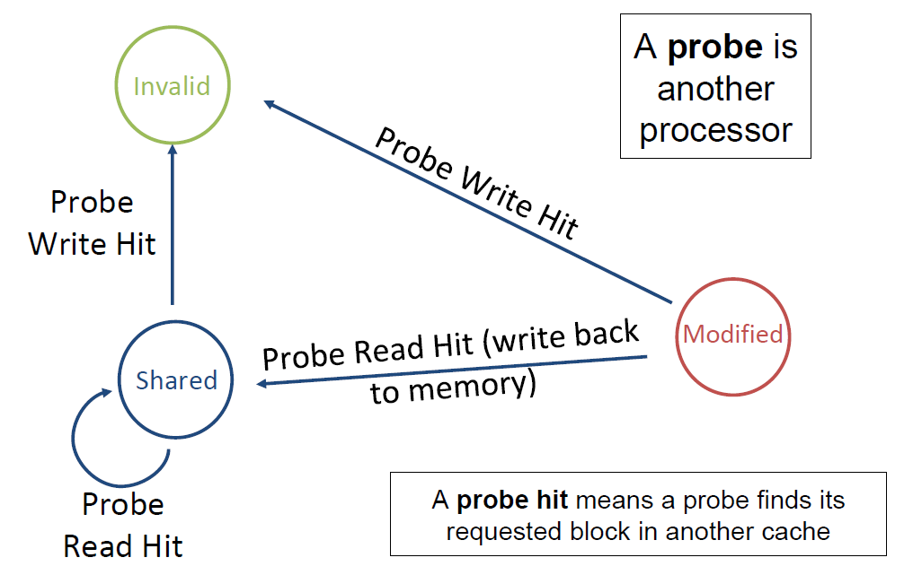

Cache block中要有相应的valid bit + dirty bit + shared bit

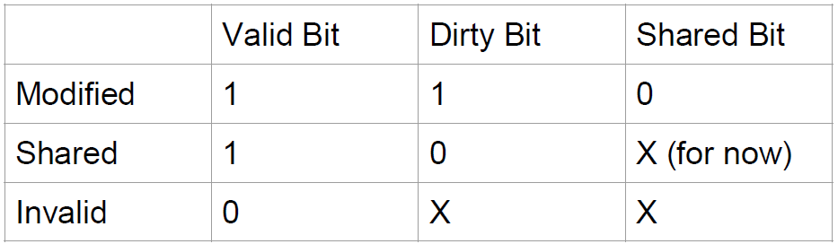

X = doesn't matter

任意一对cache中给定cache block的状态兼容表：

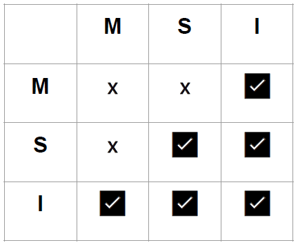

但是对shared block的写操作开销大，必须检查其它cache是否有相同的数据

对modified block的写操作就不需要检查，因为只有一个cache会含有valid modified block

### MESI

引入新状态：Exclusive state

- Exclusive: 第一个从内存获取数据的cache block，与内存数据相同，可进行写操作
  - 其它cache都不含有该数据

- Shared: 必定存在其它cache含有该数据的拷贝
  - 数据与内存的数据相同

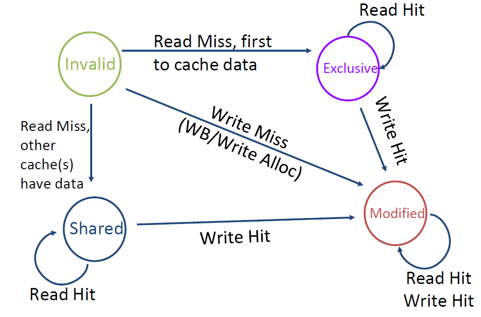

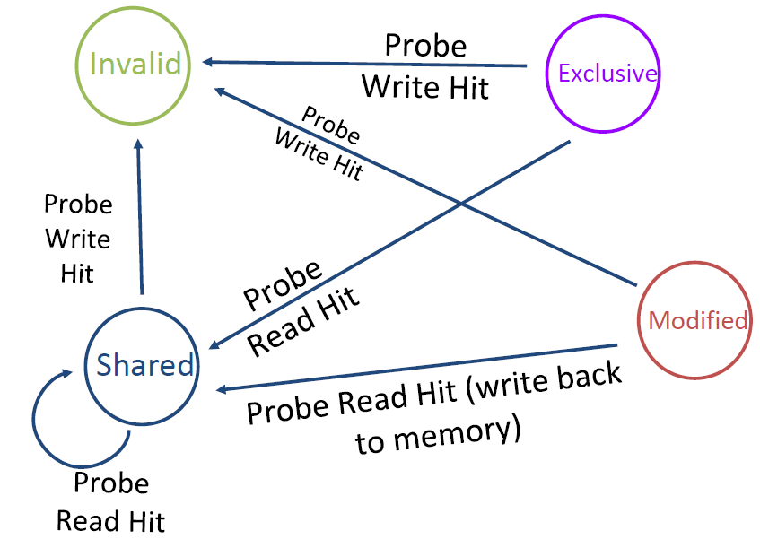

不需要对cache做新的变动

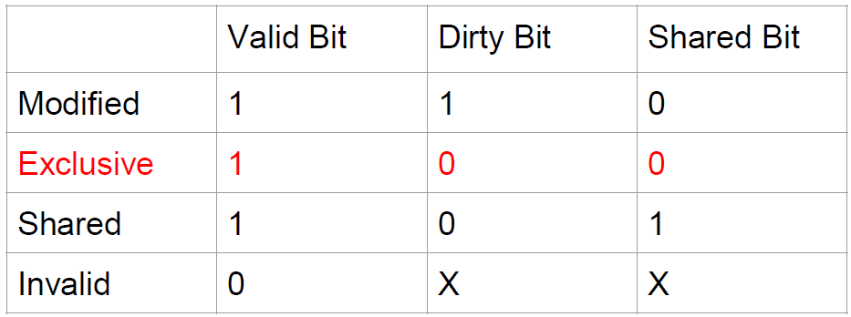

但是对于MSI和MESI而言，如果要共享修改过的数据，就必须先写回内存，开销大

### MOESI

引入新状态：Owned state

- Owner: 最新的数据，在修改时必须invalidate其它cache中的shared copies，并转化为modified
  - 其它cache有shared的拷贝
  - 内存中的数据不一定是最新的
  - Owner向其它cache的读操作提供数据，而不是到内存读取

- Shared
  - 其它cache必定有相应的拷贝
  - 内存中的数据可能是最新的

MOESI = Modified + Owner + Exclusive + Shared + Invalid

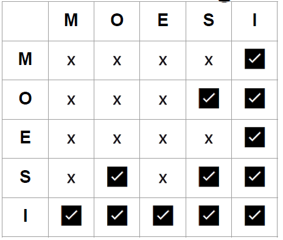

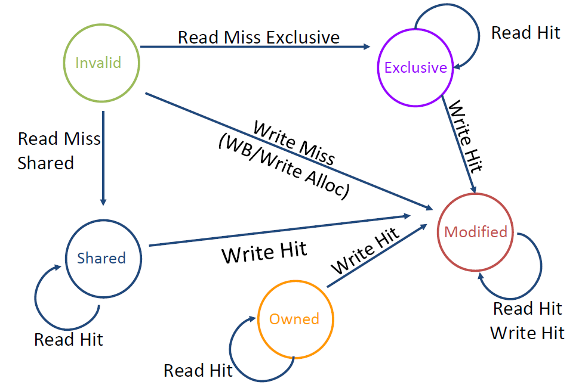

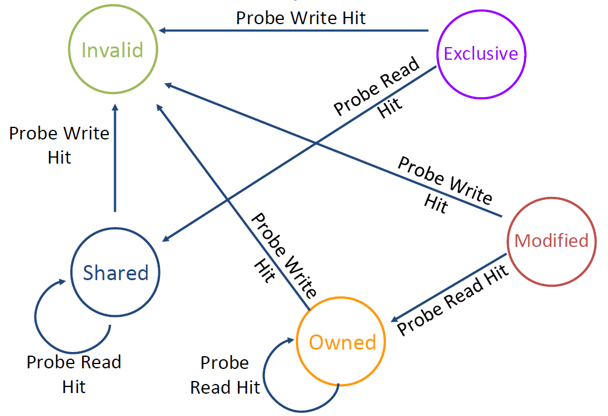

不需要对cache做新的改动

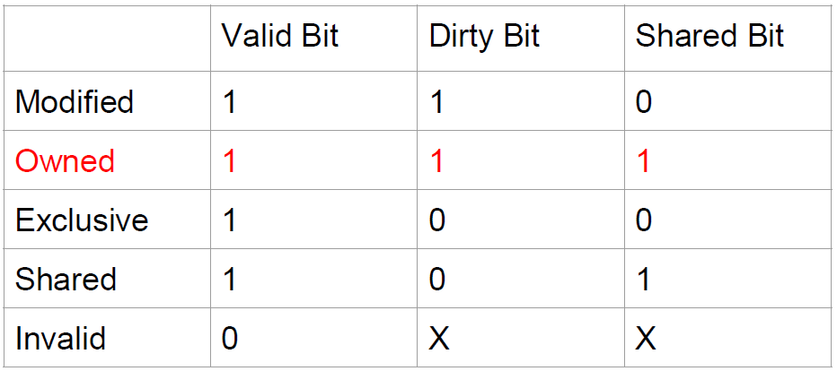

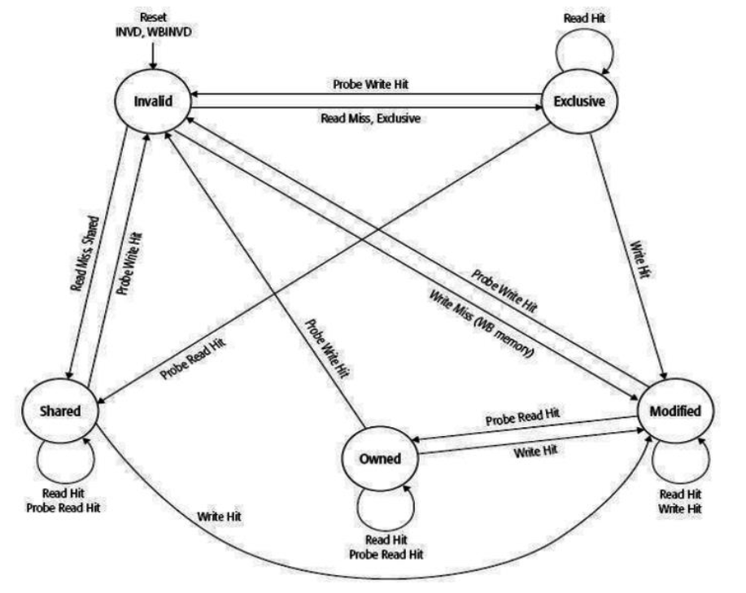

### False Sharing

两个CPU在读写同一个cache block内的不同数据，导致cache的抖动

解决方法：

- 将数据放在不同的块中
- 减小块的大小

### Real Sharing

两个CPU在读写同一个cache block内的相同数据，此时cache的抖动是无法避免的

### Cache Misses: The 4Cs

- Compulsory miss
  - 增大block size
- Capacity miss
  - 增大cache size
- Conflict miss
  - 增大cache size和associativity

- Coherence miss
  - 不同CPU之间的一致性不命中，在并行程序中可能会占主要部分