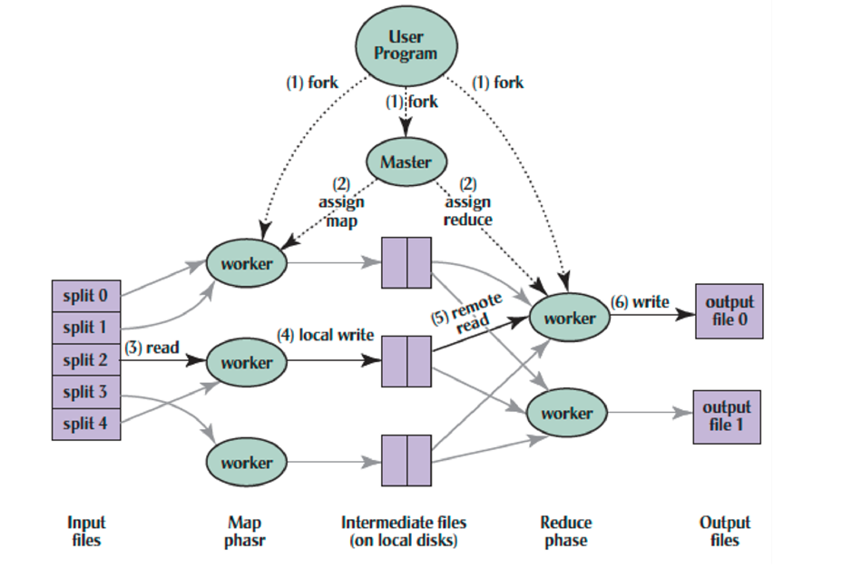

# Lec24: Warehouse Scale Computers, MapReduce

## Warehouse Scale Computers

大规模数据中心通常有10000到100000个服务器以及将它们连接在一起的网络，强调开销和效率

数据中心通常提供很大的网络服务：搜索、语音搜索、社交网络等

### Design Goals of a WSC

- Ample parallelism
  - Batch apps: many independent data sets with independent processing
- Scale and its Opportunities/Problems
  - Relatively small number of WSC make design cost expensive and difficult to amortize
  - But price breaks are possible from purchases of very large number of commodity servers
  - Must also prepare for high component failures

- Operational Costs Count
  - Cost of equipment purchases << cost of ownership


Rack中间是rack switch，通过网络与cluster switch通信

### Defining Performance

- Response Time(Latency): Time between start and completion of a task
- Throughput(Bandwidth): Total amount of work in a given time

### Coping with Performance in Array

- Lower latency to DRAM in another server than local disk
- Higher bandwidth to local disk than to DRAM in another server


对于Workload而言，白天的workload大约是晚上的2倍

### Impact of latency, bandwidth, failure, varying workload on WSC software

- WSC Software must take care where it places data within an array to get good performance
  - Latency & Bandwidth
- WSC Software must cope with failures gracefully
  - High failure rate
- WSC Software must scale up and down gracefully in response to varying demand
  - Varying workload

- WSC Software development is more challenging

### Server Power and Utilization


服务器在空闲时大约用1/2的电量，利用率达10%时用2/3的电量，利用率达50%时用90%的电量

大多数WSC的服务器利用率为10% - 50%

Energy-Proportionality: % peak load = % peak energy

### Power Usage Effectiveness

WSC能源利用率 = 执行计算工作的耗能/该过程的设备总耗能

PUE = Total Building Power/IT Equipment Power

2007年平均值为1.83

耗能的去向：


## Cloud Computing

- 提供共享平台，构建独立的抽象
  - 可能和其它用户共用
  - 利用虚拟机技术

- 具有低开销循环的优势
  - 根据不同用户对资源的利用情况来合理分配资源
  - 提高对资源的利用率

- 提供弹性服务
  - 可以花更多的钱来获取更好的硬件资源

### Cloud Services

- SaaS: Software as a Service，将应用服务传递到互联网上，不需要安装到用户的PC上，简化维护工作
  - Google Docs, Win Apps

- PaaS: Processor as a Service，将服务器平台（开发环境）作为服务，用云的基础设施来实现应用，将应用部署在云上
  - Hadoop on EC2, Apache Spark on GCP

- IaaS: Infrastructure as a Service，将基础设施作为服务，通过网络对外提供，根据用户对资源的使用量进行计费
  - Amazon Elastic Compute Cloud, Google Compute Platform


## Request Level Parallelism

搜索、社交网络等互联网服务会同时收到很多独立的请求，计算资源便会因请求而被划分


### Web Search

- Google "dank memes"
  - 将请求发送到最近的Google Warehouse Scale Computer
  - 前端的load balancer会将请求分配到WSC内的一个集群中
  - 在集群中选择一个Google Web Servers(GWS)来处理请求并形成返回的网页
  - GWS让Index Servers找到包含关键词的文件
  - 返回含有相关度信息的文件列表

- In parallel,
  - Ad system: run ad auction for bidders on search terms
  - Get images of dank memes and trash posts
- 用docids(document IDs)来访问相应的文件

- Compose the page
  - 按照相关度对文件进行排序
  - Sponsored links(along the top) and advertisements(along the sides)

- Implementation strategy
  - Randomly distribute the entries
  - Make many copies of data(a.k.a. "replicas")
  - Load balance requests across replicas

- Redundant copies of indices and documents
  - Breaks up hot spots
  - Increases opportunities for request-level parallelism
  - Makes the system more tolerant of failure

## MapReduce

- WSC支持跨机器的数据级并行，将工作分配到多台机器上
  - MapReduce & scalable file systems
  - e.g. Training CNNs with images across multiple disks

MapReduce是一个简单的数据级并行框架，主要处理大数据集

用户通过map和reduce函数来指定计算，底层运行的系统会在大型机器集群中实现并行计算，并处理机器故障，进行机器通信

### Map & Reduce Functions in Python

map(func, input stream)会对input stream中的每个元素调用func

reduce(func, result of map)会将map的结果通过func合在一起

```python
# Calculate \sum_{n=1}^{4}{n^2}
list = [1, 2, 3, 4]
def square(x):
	return x * x
def sum(x,y):
	return x + y
reduce(sum, map(square, list))
```

### MapReduce Programming Model

- Map: (in_key, in_val) -> list(interm_key, interm_val)
  - 将数据划分后分给workers处理
  - 计算intermediate key/value pairs

```python
map(in_key, in_value):
	# DO WORK HERE
	emit(interm_key, interm_val)
```

- Reduce: (interm_key, list(interm_val)) -> list(out_val)
  - 对特定的key，将所有中间值结合在一起

```python
reduce(interm_key, interm_val):
	# DO WORK HERE
	emit(out_key, out_val)
```


过程：Distribute -> Shuffle -> Collect

### MapReduce Implementation



1. User Program split inputs, start up programs(workers and master) on a cluster of machines
2. Master assign map & reduce tasks to idle workers
3. Workers perform a map task, generate intermediate key/value pairs
4. Write to the buffers(on local disks)
5. Read intermediate key/value pairs and sort them by its key

6. Workers perform a reduce task, for each intermediate key, write the result to the output files

### MapReduce Processing Time Line


- Master assigns map & reduce tasks to workers
- As soon as a map task finishes, worker servers can be assigned to a new map or reduce task
- Data sort begins as soon as a given Map finishes
- Reduce task begins as soon as all data sort finish
- To tolerate faults, reassign task if a worker server "dies"

### Big Data MapReduce Engine: Spark

Spark是针对大规模数据处理的执行MapReduce算法的框架，运行在Hadoop分布式文件系统，为数据库、机器学习、图算法提供Java, Scala, Python的API，比Hadoop要快且简单

```python
# RDD: primary abstraction of a distributed collection of items
file = sc.textFile(“hdfs://…”)
# Two kinds of operations:
# Actions: RDD → Value
# Transformations: RDD → RDD
# e.g. flatMap, Map, reduceByKey
file.flatMap(lambda line: line.split())
	.map(lambda word: (word, 1))
	.reduceByKey(lambda a, b: a + b)
```

