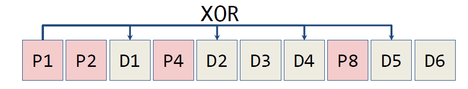
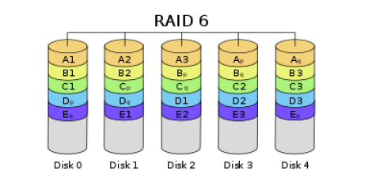

# Lec25: Dependability - Parity, ECC, RAID

## Dependability

### Measurements of Fault Tolerance, Mitigations

- Dependability
  - 避免故障
- Redundancy
  - 多份拷贝
- Error Correcting
  - Error detection
  - Error correction

Dependability: highly available, low possibility of service outages

不容易发生故障，并且能在故障发生时快速恢复

- Fault: failure of a component
  - May or may not lead to system failure

- Repair: the act of restoring normal service after a fault

### Dependability Measures

- Reliability: Mean Time To Failure(MTTF)

- Service interruption: Mean Time To Repair(MTTR)

- Mean Time Between Failures(MTBF)
  - MTBF = MTTR + MTTF

- Availability = MTTF / (MTTF + MTTR) = MTTF / MTBF
  - Increase MTTF: more reliable HW/SW + fault tolerance
  - Reduce MTTR: improved tools and processes for diagnosis and repair
  - 通常用"number of 9s of availability per year"表示

### Reliability Measures

MTTF, MTBF measured in hours/failure

- Annualized Failure Rate(AFR)
  - Average rate of failures per year
  - $AFR = (\frac{Disks}{MTTF} \times 8760\frac{hr}{yr})\times \frac{1}{Disks} = \frac{8760 hr/yr}{MTTF}$

Dependability取决于系统中最薄弱的部分，受未优化部分的限制

## Error Correcting Codes(ECC)

Dependability via Redundancy

- Applies to everything from datacenters to memory
  - Redundant datacenters so that can lose 1 datacenter but Internet service stays
    online
  - Redundant routes so can lose nodes but Internet doesn’t fail
  - Redundant disks so that can lose 1 disk but not lose data (Redundant Arrays of
    Independent Disks/RAID)
  - Redundant memory bits of so that can lose 1 bit but no data (Error Correcting
    Code/ECC Memory)

内存系统会产生错误，部分bit可能发生翻转，"Soft" errors是指在环境因素下偶尔产生的错误，"Hard" errors在芯片永久损坏的时候发生，这些问题在内存系统变得更大更密集的时候更加棘手

纠错码：对M-bit的数据块增加若干额外的bit构成N-bit的代码字(code word)

- Detection: fails code word validity check
- Correction: can map to nearest valid code word

### Hamming Distance

- Hamming distance =  # of bit changes to get from one code word to another

如果所有代码字都是valid，则min Hdist between valid code words = 1，只改变一个bit就能转化为另一个valid code word

- 如果整个code word空间都是valid，那么就无法判断一个code word是否有错误
- 只有在一部分valid，另一部分invalid的情况下才能检测到错误

### 3-Bit Visualization Aid

将每个code word视为一个节点，节点之间的边长为1，每位bit对应一个维度

对于这种一半valid一半invalid的情况，可以检测到错误，但无法纠错

这种情况就可以检测到两类错误并纠错

### Parity Bit

Parity bit表示多个bit中1的个数的奇偶性，若有奇数个1，则为1，若有偶数个1，则为0

可以用XOR来计算parity bit

原来的数的末尾加上parity bit后必然有偶数个1(even parity)

1. 在往块里写数据时，加上parity bit

2. 在读取块的数据时，检查parity，如果1的个数为奇数，则invalid，否则valid

Parity code之间的min Hamming distance为2，只能检测odd-bit的错误，无法检测even-bit的错误

纠错的最小Hamming距离至少为3

### Hamming ECC

用额外的parity bit来实现对发生错误的bit的定位

Note: Number bits starting at 1 from the left

1. Use all bit positions in the code word that are powers of 2 for parity bits
2. All other bit positions are for the data bits
3. Set each parity bit to create even parity for a group of the bits in the code word
   - 将每个parity bit专用化，每个parity bit只负责全部bit的一个子集，由parity bit的位置决定
   - parity bit p检查所有第p位为1的位置的bit，例如Bit 2检查2, 3 ,6, 7...(XX1X~2~)，相互之间可以重叠

当某一个bit发生错误时，检查该位对应的parity bit（实际上就是位置编号的二进制表示中2的次幂，e.g. 10 = 2 + 8），会出现奇数个1，并且出现奇数个1的parity bit结合起来对应唯一的错误bit

例如，parity bit 2 & 8出错，2+8=10，因此位置10处的bit是错误的，从而可以纠错

因此，1-bit error可以用parity bit检测，用Hamming ECC纠错

对于2-bit error，可以用改进的Hamming ECC检测，用Reed-Solomon code纠错

## RAID

RAID: Redundant Array of Inexpensive/Independent Disks

- Files are “shared” across multiple disks
  - Concurrent disk accesses improve throughput
- Redundancy yields high data availability
  - Service still provided to user, even if some components (disks) fail
- Contents reconstructed from data redundantly stored in the array
  - Can detect when data is corrupted
  - Can fix data/restore correct version
  - Like before, but “bit” is now “disk”

### RAID 0: Data Striping

- 将数据分割后存储在所有磁盘中
  - 并行访问磁盘，访问速度更快
  - 没有redundancy，无法承受任何故障

### RAID 1: Disk Mirroring

- 每个磁盘都完整地复制到另一个磁盘上
  - 可以达到很高的availability
  - 写操作的开销增加
    - 1 logical write = 2 physical write
    - 1 logical read = 1 physical read

### RAID 2-4: Data Striping + Parity

- 数据被分割后存储在多个磁盘中，parity disk P存放其它磁盘的parity
  - 如果一个磁盘损坏，可以用其它磁盘来恢复数据
  - 在每次写操作都要更新parity data
    - 1 logical write = min 2 to max N physical reads and writes
    - parity~new~ = data~old~ $\oplus$ data~new~ $\oplus$ parity~old~

在RAID 3中，进行1字节的写操作：1 logical write = 2 physical reads + 2 physical writes

缺点在于写操作无法独立进行，每次都会涉及到parity disk的写操作

### RAID 5: Interleaved Parity

将parity分布在每个磁盘中，每个parity负责一个子集，使得写操作可以独立进行

例如对D0和D5的写操作会用到disk 1, 2, 4, 5，互不干扰

### Newer RAID

- RAID 6: 在RAID 5的基础上增加更多的parity block，可以承受两个磁盘损坏的故障

- RAID 10: RAID 1 + 0

### Modern Use of RAID and ECC

- RAID 0 has no redundancy
- RAID 1 is too expensive
- RAID 2 is obsolete due to on-disk ECC
- RAID 3 is not commonly used(bad I/O rates)

- Typical modern code words in DRAM memory systems:
  - 64-bit data blocks with 72-bit codes

但通常情况的失效都是多个bit发生错误，由噪声、衰落信号等因素导致

- Other tools: cyclic redundancy check, Reed Solomon, Fountain Codes, LaGrange